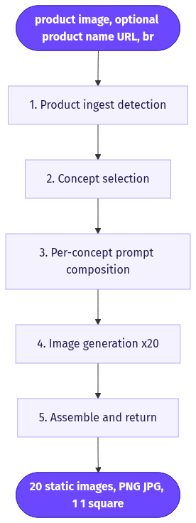
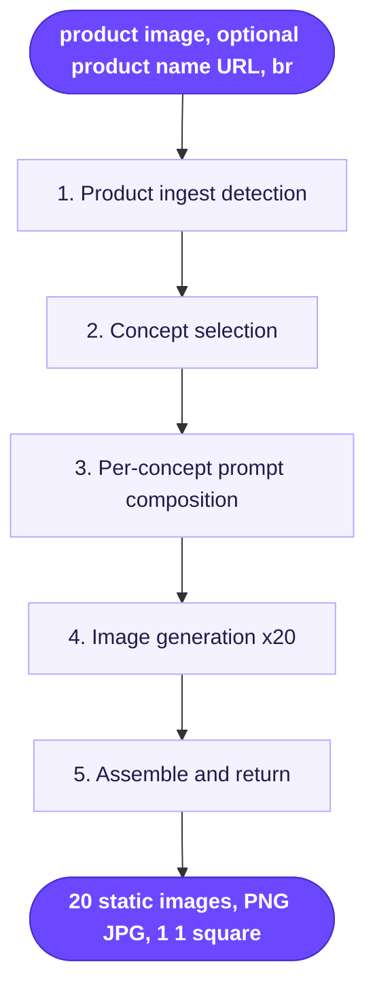

# 20 High-Converting 1x1 Static Ads

> Upload one product photo and get back 20 square static ad variations, each built on a different proven "winning concept" template and rendered with GPT Image 2.

**Category:** static-image ads  **Inputs:** product image, (optional) product name / URL, brand or angle notes  **Output:** 20 static images, PNG/JPG, 1:1 square (feed-native)

## Flow diagram



<details><summary>edit as Mermaid</summary>


</details>

## What it does
Takes a single product image and mass-produces 20 finished 1x1 static ads, each cloning the *layout and psychology* of a different high-performing ad archetype (Apple Notes list, fake Google search, comparison table, sticky-note flatlay, iMessage screenshot, editorial hero, founder letter, etc.). Instead of one idea, the advertiser gets 20 distinct concepts to A/B test in a single batch. It converts because it borrows structures that already won on Meta/TikTok, and native-app "screenshot" formats read as organic content rather than ads, beating scroll-blindness.

## Inputs
- One product image (the hero asset; used as the visual reference for fidelity).
- Optional: product name, landing-page URL, or short description.
- Optional: brand voice / angle notes (benefit, target customer, price point).

## Output
- 20 distinct static images.
- Format: raster image (PNG/JPG), 1:1 square, feed-native.
- Text/typography is *baked into the image* by GPT Image 2 (no separate caption layer); no voice, no video, single-language per run.

## How it works (step-by-step pipeline)
1. **Product ingest / detection** — PURPOSE: isolate the product and record label text, colors, form. TOOL: vision LLM (auto product detection). PROMPT APPROACH: "Describe this product forensically: exact label wording, materials, color, shape, category — for faithful re-rendering."
2. **Concept selection** — PURPOSE: pick 20 winning archetypes from the template library. TOOL: LLM against a curated library (~37 validated concepts). PROMPT APPROACH: "Given this product + angle, choose the 20 best-fitting ad concepts and adapt each one's copy/claims to the product."
3. **Per-concept prompt composition** — PURPOSE: turn each chosen archetype into a complete, product-specific GPT Image 2 prompt with exact on-image copy, layout, and safety suffix. TOOL: LLM (prompt composer). PROMPT APPROACH: fill the template's slots (headline, list items, UI chrome) with product-true claims.
4. **Image generation (x20)** — PURPOSE: render each ad. TOOL: **GPT Image 2** ("GPT2"), because it renders legible typography and mimics app UIs. PROMPT APPROACH: send the composed prompt + the product image as reference (up to 5 refs), forced to 1:1; loop/batch for all 20 concepts.
5. **Assemble & return** — PURPOSE: deliver the set. TOOL: collector node. Returns 20 square images for review/publishing (Arcads can push straight to paused Meta ads).

## Reconstructed prompts
*Reconstruction of the method — not Arcads' verbatim internal prompts.*

Concept-selection LLM step:
```
You are a direct-response creative director. Product: {name} — {forensic_description}.
Angle: {benefit / audience}.
From the concept library below, select the 20 best archetypes for this product.
For each, write: concept name, the single on-image headline (<8 words), any list/
table/UI copy, and the emotional trigger. Keep every claim product-true.
Library: apple_notes_list, fake_google_search, comparison_table, sticky_note_flatlay,
imessage_thread, chatgpt_conversation, editorial_hero, magazine_cover, founder_letter,
weather_ui, scratch_off, dating_card, billboard, review_screenshot, before_after ...
Return strict JSON: [{concept, headline, body_copy, trigger}]
```

GPT Image 2 render step (one concept — "comparison table"):
```
1:1 square Meta ad. Photorealistic. Clean side-by-side comparison table, "Us" vs
"Them". Left column = the product from the reference image, checkmarks in brand green;
right column = generic competitor, grey X marks. Rows: {benefit_1}, {benefit_2},
{benefit_3}. Bold sans headline top: "{headline}". Product rendered EXACTLY as the
attached reference (label, color, shape unchanged). Crisp, legible text, high contrast,
studio-lit, thumb-stopping. No extra logos, no watermark, no distorted text.
[reference: product_image.png]
```

## Rebuild in Creative OS
Direct fit with our **Static Ads Generator** n8n pipeline. Map: webhook + host product image (MaxFusion S3) = ingest; **Content Analyzer** (Claude vision) = step 1 forensic description; the **Strategist/prompt-composer** = steps 2–3, but swap our video shot-list output for a JSON array of 20 image prompts drawn from a **concept library node** (store the ~20 archetypes as a lookup table). Image gen: use our **nano-banana-pro** static node (renders legible text, unlike Seedance which ignores rendered text) with `aspect_ratio 1:1` and the product photo as reference for fidelity; loop the node 20x over the prompt array. Add our existing **QA gate** to reject garbled labels/text before returning. Gotchas: GPT Image 2 is Arcads' choice specifically for typography/UI mimicry — if legible on-image copy underperforms in nano-banana-pro, route via OpenRouter/an image API to a GPT-image endpoint; watch reference-image count limits (max ~5); keep claims compliant since text is baked in and hard to edit post-hoc.

## Why it's worth stealing
- **20 tested structures in one click** — batch breadth beats one hero concept for finding a Meta winner cheaply.
- **Native-format camouflage** — app-screenshot layouts (Notes, iMessage, Google) dodge ad-blindness and read as organic.
- **Library is reusable IP** — the concept templates compound; once built, every future product plugs into the same 20 winners.
