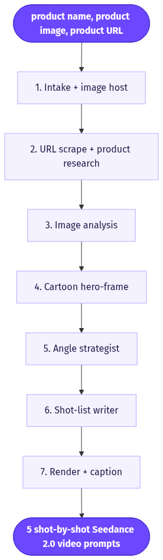
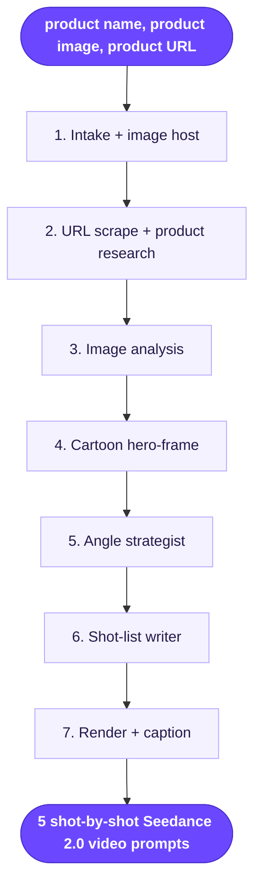

# Animated Cartoon Videos Ads

> Turns one product (name + image + URL) into five ready-to-render, shot-by-shot Seedance 2.0 prompts for animated cartoon ads, each built around a different marketing angle.

**Category:** novelty-style  **Inputs:** product name, product image, product URL  **Output:** 5 shot-by-shot Seedance 2.0 video prompts (each rendering a ~10-15s 9:16 animated cartoon ad; optional 1:1 / 16:9), Seedance-voiced, captions added in post

## Flow diagram



<details><summary>edit as Mermaid</summary>


</details>

## What it does
It generates a batch of five distinct animated-cartoon video ads for a single product in one pass. Rather than one creative, it diversifies at the *angle* level (problem/solution, benefit-led, before/after, social-proof, novelty/delight) so you can A/B which message lands. Cartoon style sidesteps the AI-actor uncanny valley and needs no real footage, so it is cheap, on-brand, and broadly likeable. The deliverable is five fully scripted Seedance 2.0 shot-lists you hit "render" on.

## Inputs
- **Product name** (used verbatim in VO/hooks)
- **Product image** (hero shot; drives shape/color/label fidelity)
- **Product URL** (landing page scraped for benefits, audience, positioning)

## Output
Five self-contained Seedance 2.0 shot-by-shot prompts, each a different angle, in a locked cartoon style. Each renders a vertical 9:16 (1:1 / 16:9 optional) animated clip with lip-synced/ambient audio from Seedance. On-screen karaoke captions are burned in post, not baked into the render.

## How it works (step-by-step pipeline)
1. **Intake + image host** — normalize name/image/URL; upload image to object storage so the models can reference it by URL.
2. **URL scrape + product research** (LLM + web fetch) — pull the landing page; extract benefits, target audience, tone, and 3-5 proof points. Prompt goal: a compact structured brief.
3. **Image analysis** (vision LLM) — forensic read of the product image (form, colors, label text, silhouette). Goal: fidelity anchors the cartoon must preserve.
4. **Cartoon hero-frame** (GPT-image / image model) — restyle the product photo into a clean cartoon keyframe. Goal: a *stylized* reference so Seedance renders cartoon, not photoreal.
5. **Angle strategist** (LLM) — generate 5 non-overlapping angles + a one-line creative brief and hook for each. Goal: message diversity, not visual diversity.
6. **Shot-list writer** (LLM, x5) — turn each brief into a Seedance-native shot-by-shot prompt: 2-second hook, 3-4 beats, VO lines <10 words, a locked style stack (art style, line weight, palette, fps), one ambient sound per shot.
7. **Render + caption** (Seedance 2.0 i2v -> whisper -> ffmpeg) — image-to-video off the cartoon hero-frame, generate audio on; word timestamps -> burned captions -> stitch.

## Reconstructed prompts
> Reconstructions of the *method*, not Arcads' verbatim internal prompts.

**Angle strategist (LLM):**
```
Product: {name}
Brief (from URL + image): {research_json}

Return 5 DISTINCT ad angles for a short animated cartoon video ad.
Angles must not overlap in message. Choose from: problem/agitate/solve,
benefit-led, before/after, social-proof/testimonial, novelty/delight.
For each: {angle, target_emotion, one_line_brief, spoken_hook (<8 words)}.
Output JSON array of 5.
```

**Shot-list writer (LLM) -> Seedance 2.0:**
```
Write ONE shot-by-shot Seedance prompt for angle: {angle}.
Format EXACTLY:
Line 1 header: "4 shots, 12s, 9:16, 2D flat-vector cartoon, bold 4px
outlines, saturated pop palette, 24fps, squash-and-stretch."
Then numbered "Shot n (0-3s | BEAT):" joined with "Cut to".
Hook shot uses a smash-zoom or exaggerated reaction face.
Product ({name}) is the hero and stays on-model with its real colors/label.
Spoken lines as - says: "..." - under 10 words. One ambient sound per shot.
End: "No music. No logo. No text on screen."
```

**Example generated output (before/after angle):**
```
4 shots, 12s, 9:16, 2D flat-vector cartoon, bold 4px outlines, saturated
pop palette, 24fps, squash-and-stretch.
Shot 1 (0-3s | HOOK): tired cartoon character slumps at a messy desk,
exaggerated groan, dark circles - says: "Every morning felt impossible."
Cut to
Shot 2 (3-6s | TURN): {product} smash-zooms in with a sparkle burst,
character's eyes pop wide - says: "Then this changed everything."
Cut to
Shot 3 (6-9s | PROOF): character bounces, color washes warm, energy lines
radiate - says: "Clean energy, zero crash."
Cut to
Shot 4 (9-12s | PAYOFF): confident stride, {product} held up, thumbs-up
freeze-frame. ambient: bright chime.
No music. No logo. No text on screen.
```

## Rebuild in Creative OS
- **Intake + S3 host + Content Analyzer** map 1:1 to our webhook -> MaxFusion S3 -> Claude-vision nodes.
- **Add a URL-scrape node** (fetch landing page -> Claude summarizes into the research brief) - we don't currently pull the product URL.
- **Strategist** already bundles Creative Director + Story Director; extend it to emit **5 angle briefs**, then loop the shot-list writer 5x (or one call returning 5). Add a **style bucket D = "animated cartoon"** to the 15-format library.
- **Shot format is already ours:** header line + "Shot n (0-3s | BEAT):" + "Cut to" + `- says: "..."` + one ambient sound + "No music. No logo. No text on screen." Only the header swaps `amateur iPhone UGC` for the cartoon style stack.
- **Key gotcha - reference image:** Seedance i2v off the raw product photo renders *photoreal*. Add a **cartoon hero-frame step** (nano-banana-pro / GPT-image restyle) and pass that as `reference_image_urls`, or output is not a cartoon. Lock ONE style string + character across all 5 for a consistent set.
- **Render:** KIE `bytedance/seedance-2` standard (mini garbles labels), 9:16, `generate_audio: true`; whisper (Groq) -> Claude caption zones -> ffmpeg Montserrat karaoke. Captions stay post - Seedance ignores rendered text.

## Why it's worth stealing
- **Angle-level A/B in one click:** one input set yields 5 message-diverse creatives, so testing is cheap and structured.
- **No footage, no actors:** cartoon dodges the AI-actor uncanny valley and licensing/UGC costs while staying brand-safe and broadly appealing.
- **Reusable across every product:** the angle framework + Seedance shot template is product-agnostic; the moat is the strategist, not any single ad.
