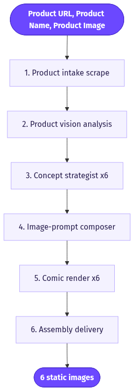
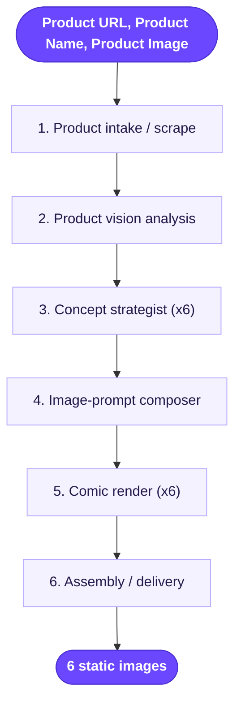

# Comic Strip Static Ads

> Turns one product into 6 scroll-stopping multi-panel comic ads, each a different art style and marketing angle, as flat static images with the dialogue and product baked in.

**Category:** static-image ads  **Inputs:** Product URL, Product Name, Product Image  **Output:** 6 static images (PNG), 2-6 panel comic layouts, Meta aspect ratios (1:1, 4:5, 9:16), text/speech-bubbles baked in, no voice or video, not localized by default

## Flow diagram



<details><summary>edit as Mermaid</summary>


</details>

## What it does
It packages a product's core promise as a tiny sequential story — problem, discovery, product, payoff — laid out as comic panels inside a single image. Comics convert because the panel-to-panel narrative pulls the eye down the whole creative (native "stop the scroll" pacing), the speech bubbles carry the sales copy without looking like an ad, and the style range lets one product hit six different audiences from one input. Each of the 6 outputs varies both the art style (newspaper strip, manga, pop-art, webtoon, etc.) and the angle (pain-point, before/after, testimonial, objection-handling), so a media buyer gets a ready-to-test batch, not one guess.

## Inputs
- **Product URL** — scraped for name, benefits, claims, tone, audience.
- **Product Name** — used in captions and the CTA panel.
- **Product Image** — the visual reference so the drawn product stays recognizable across every panel.

## Output
6 static comic-strip images. Each is a single flat PNG containing a 2-6 panel grid with drawn characters, speech bubbles, caption boxes and a final CTA panel — all text rendered inside the image. Delivered in Meta-native ratios (1:1 feed, 4:5, 9:16 story/Reel). No audio, no motion, no captioning pass (the copy is already drawn in), no translation unless re-run per locale.

## How it works (step-by-step pipeline)
1. **Product intake / scrape** — PURPOSE: pull name, benefits, claims, audience, tone from the URL. TOOL: LLM with URL/scrape context. PROMPT: "Extract the product's promise, top 3 benefits, the customer pain it removes, and the buyer's voice."
2. **Product vision analysis** — PURPOSE: describe the physical product so it can be drawn faithfully. TOOL: vision LLM on the Product Image. PROMPT: forensic description of shape, color, label, form factor — the "identity lock" for every panel.
3. **Concept strategist (x6)** — PURPOSE: invent 6 distinct comic concepts. TOOL: LLM. PROMPT: assign each a unique (angle x art style) pair and write a 2-6 beat script with per-panel scene direction, character, bubble line (<8 words) and the closing CTA panel.
4. **Image-prompt composer** — PURPOSE: turn each script into one render-ready image prompt. TOOL: LLM. PROMPT: emit a single comic-layout prompt describing panel count, per-panel action + dialogue text, the product (from step 2), the named art style, and aspect ratio.
5. **Comic render (x6)** — PURPOSE: draw the finished multi-panel image with legible in-image text. TOOL: GPT-image-2 (their typography/UI-mimicry model, best at text-in-image) with the Product Image as reference. Single generation per ad = free character/product consistency across panels.
6. **Assembly / delivery** — PURPOSE: resize to the requested ratios and return the 6-image batch. TOOL: image export.

## Reconstructed prompts
_Reconstructions of the method — not Arcads' verbatim prompts._

Concept strategist (LLM):
```
You are a direct-response comic ad director. Product: {name}. Facts: {benefits, pain, audience, tone}.
Produce 6 comic-ad concepts. Each MUST use a different ANGLE (pain-point, before/after,
testimonial, humor, FOMO, objection-handling) AND a different STYLE (classic newspaper 4-koma,
manga, retro pop-art Ben-Day dots, modern webtoon, minimal line-art, painterly Sunday-color).
For each concept output: title, angle, style, panel_count (2-6), and per-panel {scene, character,
bubble_text (<=8 words), caption_box (optional)}. Final panel is always the product + CTA.
Keep every line of drawn text short enough to render cleanly.
```

Comic render (GPT-image-2, product image attached as reference):
```
A {panel_count}-panel {style} comic strip advertisement, clean gutters, bold panel borders,
{1:1 / 4:5 / 9:16}. Keep the product identical to the reference image (shape, color, label).
Panel 1: {scene} — speech bubble: "{bubble_text}".
Panel 2: {scene} — caption box: "{caption}".
... 
Final panel: hero shot of {product name} with CTA bubble "{cta}".
Legible hand-lettered bubble text, consistent character across panels, vibrant {style} palette,
no watermark, no gibberish text.
```

## Rebuild in Creative OS
- **Intake + host:** reuse the existing webhook -> MaxFusion S3 image-host node unchanged.
- **Product analysis:** reuse the **Content Analyzer** (Claude vision, forensic product description) as the step-2 identity lock.
- **Strategist:** fork the existing big-Claude **Strategist** prompt, but swap its Seedance shot-list output for the 6-concept comic JSON above (angle x style matrix + per-panel bubbles). This is closer to the n8n **Static Ads Generator** than to the video pipeline — build it there.
- **Render:** this is a static-image job, so route to an image model, not KIE Seedance. Our Static Ads Generator already runs **nano-banana-pro**; use it, or GPT-image via OpenRouter for cleaner in-panel text. Pass the hosted Product Image as the reference (same fidelity principle as Seedance `reference_image_urls`).
- **Skip** the whisper -> caption-zone -> ffmpeg karaoke chain entirely; comic text is drawn in, so there's no post-caption pass and no video render.
- **Gotchas:** (1) image models garble long text — cap bubble copy at ~6-8 words and enforce it in the strategist. (2) nano-banana-pro is weaker at dense lettering than GPT-image-2, so prefer GPT-image for text-heavy panels or keep panels to <=4. (3) One image per concept keeps character/product consistent for free; do **not** render panels separately. (4) Add the existing QA gate to reject outputs with unreadable/gibberish bubbles.

## Why it's worth stealing
- **6 tests from one input** — an instant creative-diversity batch (angle x style) with zero extra briefing, ideal for cheap Meta split-testing.
- **Copy hides inside the story** — dialogue in bubbles reads as entertainment, not an ad, so it survives ad fatigue better than typography cards.
- **Cheap and fast for us** — pure image generation, no video/caption/render cost, and it reuses nodes we already run in the Static Ads Generator.
