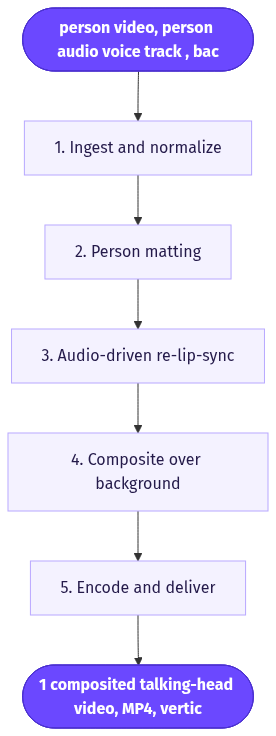
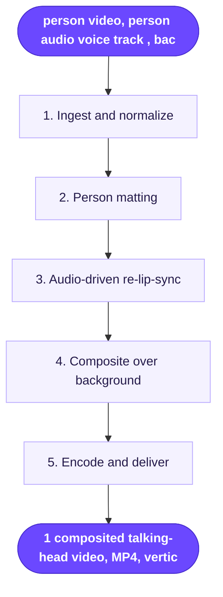

# Create Your AI Clone

> Cut a real person out of one video, re-lip-sync them to a supplied voice track, and drop them onto any background image to produce a fresh talking-actor clip.

**Category:** AI clone/actor  **Inputs:** person video, person audio (voice track), background image  **Output:** 1 composited talking-head video, MP4, vertical 9:16 (also 1:1 / 16:9), voiced by the supplied audio, lip-synced, not auto-captioned or localized

## Flow diagram



<details><summary>edit as Mermaid</summary>


</details>

## What it does
This workflow turns existing footage of one person into a reusable "digital actor" you can re-place and re-voice at will. It matte-extracts the person from their source video, re-drives their mouth to a new audio track, and composites the result over a new background plate. It converts every real testimonial or talking-head you already have into an endlessly re-scriptable, re-locatable asset, which is what makes it convert: the face and mannerisms are a proven real human, but the words, setting, and offer are swappable per campaign without a reshoot.

## Inputs
- A short **video of a person** (source appearance + body motion; ideally framed head-and-shoulders).
- An **audio file of that person speaking** (the new voice/script line the clip should say).
- A **background image** (the scene/plate to place them into).

## Output
One rendered video of the selected person, cut out and comped onto the chosen background, with lips re-synced to the supplied audio. Delivered as MP4, defaulting to 9:16 (1:1 and 16:9 available), same length as the audio track. Voiced by the provided audio; captions and translation are separate downstream steps, not baked in here.

## How it works (step-by-step pipeline)
1. **Ingest & normalize** — Accept the three inputs; probe duration/resolution and trim video/audio to a common length. TOOL: ffmpeg/ffprobe. PROMPT APPROACH: none (deterministic).
2. **Person matting** — Remove the background from the source video to a clean alpha cutout of the person. TOOL: Arcads "Remove Background" (video segmentation/matting; equiv. RVM/BiRefNet). PROMPT APPROACH: none; per-frame subject mask.
3. **Audio-driven re-lip-sync** — Re-animate the cutout's mouth (and subtle head/jaw) to match the new audio. TOOL: Arcads Audio-Driven / Omnihuman 1.5 talking-actor engine. PROMPT APPROACH: audio waveform + face crop → viseme-timed mouth motion; keep identity locked.
4. **Composite over background** — Place the lip-synced cutout onto the background image, matching scale, position, edge feather and color/light. TOOL: Arcads "Merge Layers". PROMPT APPROACH: none; layer stack (bg image → person alpha).
5. **Encode & deliver** — Mux final audio, crop/pad to target aspect, export MP4. TOOL: ffmpeg. PROMPT APPROACH: none.

## Reconstructed prompts
*Reconstructions of the method — not Arcads' verbatim internal prompts.*

Matting (config, not a language prompt):
```
subject: single foreground person
mode: video matte, per-frame alpha
edge: hair-safe, 2px feather
output: RGBA ProRes 4444 / VP9 alpha
```

Audio-driven lip-sync (model call):
```
task: audio_to_talking_head
face_source: person_cutout.mov (alpha)
drive_audio: voice_track.wav
identity_lock: true            # do not alter face shape/skin
motion: mouth + minor jaw/head; eyes natural blink
sync: viseme-aligned to audio phonemes
```

Composite (layer/ffmpeg intent):
```
[0] background.jpg  -> scale to 1080x1920, cover
[1] talking_head.mov (alpha) -> scale 0.9, anchor bottom-center, feather 2px
overlay [0][1]; match_color=true; audio=voice_track.wav
```

## Rebuild in Creative OS
- **Ingest / encode / composite:** our VPS **ffmpeg** already covers steps 1, 4, 5 — overlay filter with the alpha layer over the background plate, then aspect crop and audio mux.
- **Matting:** add a background-removal step (rembg/BiRefNet or `backgroundremover` on the VPS, or a KIE/fal matte endpoint) — we don't have this today.
- **Lip-sync:** this is the gap. **Seedance-2 via KIE is the wrong tool** here — it generates net-new shots from a product reference and cannot faithfully re-drive a specific real person. Add an **audio-driven avatar model** (Omnihuman / sync.so / LatentSync via fal or KIE) fed the face crop + our audio. Our Seedance-native shot-list format does not apply; this is compositing, not shot generation.
- **Voice & captions:** reuse our **whisper (Groq) word timestamps → Claude caption-zone → ffmpeg karaoke burn** stack as an optional downstream layer if a captioned cut is wanted; hosting via the **MaxFusion S3** bucket. Gotcha: alpha survives only in ProRes 4444 / VP9 — never pass the cutout through an intermediate H.264 step.

## Why it's worth stealing
- **Reshoot-free scale:** one real clip becomes an infinite bank of re-scripted, re-located ads — the face stays a proven human while the words/setting swap.
- **Modular and portable:** matte → lip-sync → composite are independent nodes we can reuse in other workflows (e.g., drop any winning actor onto any brand background plate).
- **Trust + control:** you keep a genuine person's credibility for conversion while gaining generative flexibility over voice, offer, and scene per placement.
