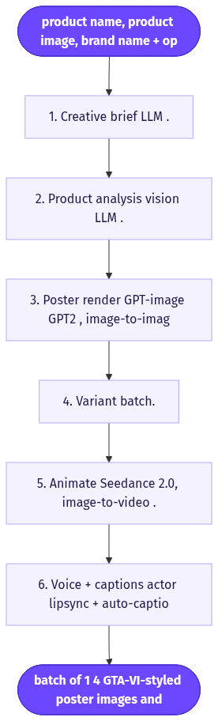
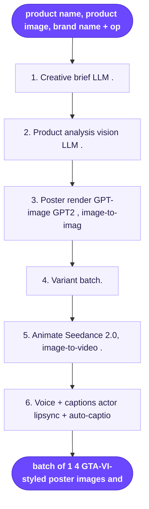

# GTA 6 Style Ad

> Re-skins a product or brand as a Grand Theft Auto VI loading-screen / cover-art poster — bold-outlined, neon Vice City, magenta-and-teal — then optionally animates it into a "living poster" scroll-stopper.

**Category:** novelty-style (static ad + optional animated video)  **Inputs:** product name, product image, brand name (+ optional logo), optional product URL, optional character/creator reference, target aspect ratio  **Output:** batch of 1–4 GTA-VI-styled poster images and/or 6–15s animated clips, 9:16 / 1:1 / 16:9, captioned + optionally voiced

## Flow diagram



<details><summary>edit as Mermaid</summary>


</details>

## What it does
Rides the viral "turn X into GTA 6 art" trend by rendering your product (or a character using it) as a Rockstar-style loading-screen splash: heavy black outlines, semi-realistic cel-shading, saturated tropical palette, art-deco Vice City neon behind, brand name set in bold retro game-poster type. It stops the scroll through pure pattern-interrupt — an ad that reads as fan art. An optional pass animates the poster (slow push-in, neon flicker, palm sway) into a trailer moment.

## Inputs
- Product image (used as visual reference for fidelity)
- Product / brand name (baked into the poster as retro GTA-style typography)
- Optional logo, product URL, and a character/creator reference to feature holding the product
- Target aspect ratio and count

## Output
1–4 illustrated GTA-VI poster stills, optionally each animated into a 6–15s clip. 9:16 for feed/Stories, 1:1, 16:9. Video variants ship with burned-in captions and an optional voiceover/AI-actor line.

## How it works (step-by-step pipeline)
1. **Creative brief (LLM).** Reads product name/URL/image; writes a GTA-themed scene concept — who's on the poster, what pose, which product beat, plus a short punchy hook. Prompt goal: map the product's benefit onto a Vice City vignette and a scroll-stopping headline.
2. **Product analysis (vision LLM).** Forensic description of the product (shape, colors, labels) so the render keeps it recognizable. Prompt goal: preservation constraints for the image step.
3. **Poster render (GPT-image / "GPT2", image-to-image on the product ref).** Generates the GTA-VI cover art with the product/character composited in. Prompt goal: enforce bold clean outlines, cel-shading, magenta/teal neon, art-deco backdrop, and the brand name in retro type — while preserving product fidelity.
4. **Variant batch.** Re-rolls poses/backgrounds/palettes for A/B testing.
5. **Animate (Seedance 2.0, image-to-video).** Turns the chosen still into a living poster: slow camera push-in, neon flicker, light rain, subtle character turn. Prompt goal: motion only, never restyle.
6. **Voice + captions (actor/lipsync + auto-caption stitch).** Optional VO/AI-actor hook line; burns karaoke captions; exports per aspect ratio.

## Reconstructed prompts
*Reconstructions of the method — not Arcads' verbatim prompts.*

Poster (image-to-image on product photo):
```
Re-render the attached product as GTA VI loading-screen cover art.
Keep the product's exact shape, colors, and label text recognizable and sharp.
Style: bold clean black outlines, semi-realistic cel-shading, high saturation,
1980s synthwave Vice City. A confident character in designer streetwear holds/uses
the product, low-angle hero pose. Background: neon palms, art-deco skyline at
dusk, luxury sports car, magenta-and-teal rim lighting, dramatic shadows, film grain.
Set the brand name "<BRAND>" as bold retro game-poster typography, top third.
Vertical 9:16 promotional composition. No real Rockstar/GTA logos or marks.
```

Animate (Seedance image-to-video, reference = poster):
```
Animate this poster as a 10s GTA VI trailer moment. Do NOT restyle or redraw.
Slow cinematic camera push-in, neon signs flicker, palm fronds sway, faint rain
and anamorphic lens flare, character makes one slow confident turn toward camera.
Magenta-orange synthwave grade, film grain, photorealistic slow motion. 9:16.
```

## Rebuild in Creative OS
- **Brief + product analysis:** reuse the **Content Analyzer** (Claude vision, forensic description) and a trimmed **Strategist** prompt — but retarget it to output a GTA scene brief + baked-in headline instead of the 15-format UGC shot list.
- **Poster render:** this is the one new node — Seedance/KIE ignores rendered text, so the poster must come from our **static path (nano-banana-pro, Static Ads Generator)** as image-to-image on the hosted product photo, with brand typography baked in. Host output on MaxFusion S3.
- **Animate:** feed that poster to **KIE `bytedance/seedance-2` (standard)** as `reference_image_urls`, 9:16, `generate_audio` off (add music-free ambience), motion-only prompt — same living-poster pattern, not our numbered "Shot n / Cut to" shot-list format.
- **Captions/VO:** existing whisper→Claude-zones→ffmpeg karaoke burn; optional VO line.
- **Gotchas:** avoid literal "GTA"/"Rockstar" marks (trademark refusals — use "style of" descriptors); product fidelity comes entirely from the reference image; keep all typography in the image step, never expect Seedance to render it; standard KIE tier for clean labels.

## Why it's worth stealing
- **Pattern-interrupt:** looks like fan art, not an ad — earns organic saves/shares and cheap reach on the back of a live trend.
- **Product-agnostic + batchable:** one product photo → many posters/clips, ideal for rapid A/B testing.
- **Reuses 90% of our stack:** only the GTA-poster prompt block is new; analyzer, nano-banana statics, KIE animate, and caption burn all carry over.
