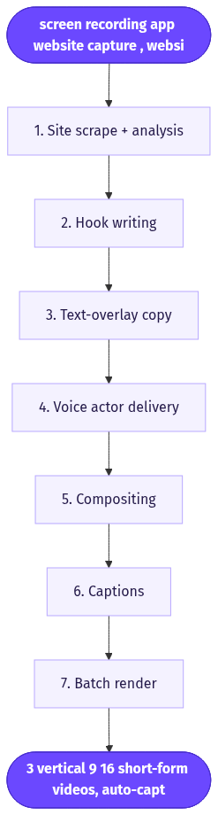
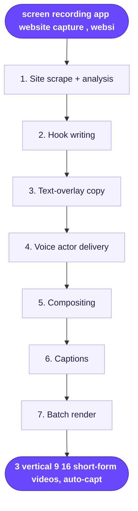

# Hook Generator for your App/Website

> Turns a raw screen recording plus a website URL into 3 ready-to-test TikTok-style hook openers that show your app/website in action.

**Category:** hook tool  **Inputs:** screen recording (app/website capture), website URL  **Output:** 3 vertical 9:16 short-form videos, auto-captioned, AI-voiced, each intercut with the uploaded screen recording

## Flow diagram



<details><summary>edit as Mermaid</summary>


</details>

## What it does
It manufactures the single most important 2-4 seconds of an app/SaaS ad: the scroll-stopping hook. From your website URL it infers the product, its core pain point, and the audience, writes 3 distinct hook angles (problem-agitation, curiosity/pattern-interrupt, bold-claim), then renders each as a short clip where an AI actor or voiceover delivers the line while your real screen recording plays underneath. It converts because 3-second hold rate is the leading predictor of CTR/CVR, and it lets you A/B three openers against the same demo footage without re-shooting.

## Inputs
- A screen recording of your app or website (the demo b-roll).
- Your website URL (used to auto-derive product, value prop, pain point, tone).

## Output
- 3 separate short-form videos, 9:16 (TikTok/Reels/Shorts native).
- Each: an AI-voiced/actor-delivered hook line + burned text-overlay hook + your screen recording as the visual + auto-captions. Different angle per variant; no localization by default.

## How it works (step-by-step pipeline)
1. **Site scrape + analysis** — Purpose: understand what to hook. Tool: fetch/scrape the URL (HTML + screenshot) into an LLM. Prompt: extract product name, category, #1 user pain, audience, tone.
2. **Hook writing** — Purpose: 3 divergent openers. Tool: LLM. Prompt: write 3 TikTok hooks under ~10 words, each a different angle (pain, curiosity, bold claim), first-person native voice, no jargon.
3. **Text-overlay copy** — Purpose: on-screen hook text. Tool: same LLM pass, shortens each hook to a punchy overlay string in the 9:16 safe zone.
4. **Voice/actor delivery** — Purpose: give the hook a human voice. Tool: Arcads AI actor + lip-sync (or TTS voiceover). Prompt: deliver the hook line, energetic UGC read.
5. **Compositing** — Purpose: show the app. Tool: video editor/stitch — actor talking-head or voiceover over the uploaded screen recording (cut-to or picture-in-picture).
6. **Captions** — Purpose: silent-watch retention. Tool: auto-caption engine, word-synced.
7. **Batch render** — Purpose: 3 testable variants. Tool: render queue, 9:16.

## Reconstructed prompts
*Reconstructions of the method, not Arcads' verbatim prompts.*

Hook writer (LLM):
```
You are a TikTok performance-ad copywriter. Product context: {scraped_summary}.
Write 3 hooks, each a DIFFERENT angle:
1) problem-agitation  2) curiosity / pattern-interrupt  3) bold claim.
Rules: <=10 words, first-person, spoken like a real user, no brand jargon,
must make a scroller stop in 2s. Return JSON: [{angle, spoken_line, overlay_text}].
```

Actor/voice step (per hook):
```
Deliver this line to camera, high-energy UGC read, casual, slight urgency:
"{spoken_line}". Natural pacing, ~2.5s.
```

## Rebuild in Creative OS
- **Site scrape → analysis:** add a fetch node (website HTML + screenshot to MaxFusion S3), then reuse our **Content Analyzer** (Claude vision) to produce the forensic summary — same role it plays for product images.
- **Hook writing:** a trimmed **Strategist** call — Claude returns just the 3-angle JSON above, not a full shot-list.
- **Actor hook clip:** we have no lip-sync actor engine; substitute a Seedance-native talking-head. Feed a UGC-creator reference image to KIE `bytedance/seedance-2` (standard tier), `generate_audio: true`, 9:16, with our shot format: header `1 shot, 3s, 9:16, amateur iPhone UGC...` then `Shot 1 (0-3s | HOOK):` with `- says: "{spoken_line}" -`, one ambient sound, `No music. No logo. No text on screen.`
- **Compositing:** ffmpeg on the VPS concatenates the Seedance hook clip + the user's uploaded screen recording (host it on S3 first) — Seedance can't ingest real footage, so keep the recording as real b-roll.
- **Captions + overlay:** existing pipeline — whisper (Groq) timestamps → Claude picks zones → ffmpeg burns karaoke captions (Montserrat ExtraBold) plus the static overlay_text. Gotcha: Seedance ignores rendered text, so ALL text is post-ffmpeg.
- Loop 3x for the 3 angles.

## Why it's worth stealing
- **Reuses real footage:** the demo b-roll is user-supplied, so product fidelity is perfect — no model has to fake a UI.
- **Hook-only A/B:** isolates the highest-leverage variable (the opener) into 3 cheap variants against one demo.
- **URL-to-context is low-friction:** the user enters one link and the system does the strategy work — ideal for SaaS/app clients who can't write ad copy.
