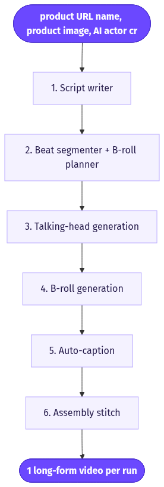
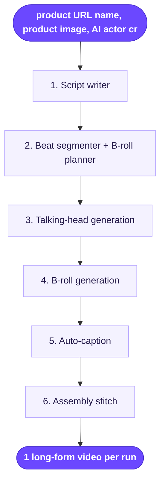

# Long-Form with Automated B-Roll

> Turns a long AI-actor script into a full VSL-style ad where relevant B-roll clips are auto-generated per script beat and cut over the talking head.

**Category:** long-form  **Inputs:** product URL/name, product image, AI actor (creator) reference, script (or script brief), aspect ratio  **Output:** 1 long-form video per run (30-90s+), MP4, 9:16 primary (16:9 / 1:1 optional), captioned + voiced, single language

## Flow diagram



<details><summary>edit as Mermaid</summary>


</details>

## What it does
A single AI actor delivers a long script (hook -> problem -> solution -> proof -> CTA), and the workflow automatically breaks that script into beats, generates a matching B-roll clip for each beat, and cuts those clips over the talking head at the right timestamps. It converts because long-form holds attention only if the visuals keep changing: the actor builds trust while the auto-B-roll keeps the frame moving and shows the product in context, killing the "static talking head" drop-off.

## Inputs
- Product URL, product name, and a product image (for fidelity/reference)
- An AI actor / creator reference (the face + voice for the whole video)
- A script, or a short brief the LLM expands into a long script
- Aspect ratio and target duration

## Output
One long-form ad (typically 30-90+ seconds) as MP4, 9:16 by default (16:9/1:1 selectable). Fully voiced by the actor's lip-synced voice engine, auto-captioned (word-level karaoke), single language per run. Delivered assembled, not as loose clips.

## How it works (step-by-step pipeline)
1. **Script writer** — PURPOSE: produce a long, structured VSL-style script. TOOL: LLM. PROMPT APPROACH: enforce a beat structure (hook/agitate/solution/proof/CTA) with short spoken sentences and a length target.
2. **Beat segmenter + B-roll planner** — PURPOSE: split the script into timed beats and decide which need a cutaway, writing one visual prompt per cutaway. TOOL: LLM. PROMPT APPROACH: return JSON `[{sentence, needs_broll, broll_prompt}]`, product-relevant and literal to the line.
3. **Talking-head generation** — PURPOSE: the actor delivers the full script. TOOL: AI actor + lip-sync + voice engine. PROMPT APPROACH: feed the actor reference + full script; this is the base A-roll track and the master audio.
4. **B-roll generation** — PURPOSE: one 3-6s clip per flagged beat. TOOL: Seedance 2.0 (image-to-video), product image as reference. PROMPT APPROACH: literal, in-context product/lifestyle shots matching each beat's words.
5. **Auto-caption** — PURPOSE: word-level timestamps + burned karaoke captions. TOOL: whisper-style ASR + caption renderer.
6. **Assembly / stitch** — PURPOSE: lay B-roll over the A-roll at each beat's timestamp, keep actor audio, burn captions. TOOL: ffmpeg (overlay + concat).

## Reconstructed prompts
*Reconstructions of the method, not Arcads' verbatim prompts.*

Script (LLM):
```
Write a 60-second UGC video ad script for {product_name} ({product_url}).
Structure: HOOK (0-3s) | PROBLEM | SOLUTION | PROOF | CTA.
Spoken, first-person, casual. Sentences under 12 words. Plain text only,
no scene directions. Target ~150 words.
```

B-roll planner (LLM):
```
Split this script into sentences. For each, decide if a B-roll cutaway helps
the viewer SEE what's said. Return JSON:
[{ "sentence": "...", "needs_broll": true,
   "broll_prompt": "literal shot of {product} in context, amateur iPhone, 9:16" }]
Only flag concrete/visualizable lines. Reference the product image for accuracy.
```

B-roll clip (Seedance 2.0):
```
Amateur iPhone UGC, 9:16, 5s. {broll_prompt}. Product matches reference image
exactly. Natural handheld motion, real lighting. No text, no logo, no music.
```

## Rebuild in Creative OS
- **Script + planner** -> extend our Strategist Claude prompt with a "long-form" mode that emits a beat list *and* a per-beat B-roll flag/prompt in one JSON pass (reuse the shot-list discipline, just longer).
- **Talking head** -> we don't have a native actor engine; either add an actor/lip-sync provider or generate the A-roll as a UGC selfie-monologue via KIE seedance-2 with `generate_audio` off and dub with a TTS/voice track.
- **B-roll** -> exactly our current path: KIE bytedance/seedance-2 standard, 9:16, `reference_image_urls` = product photo, `generate_audio` false (audio comes from A-roll). Use our Seedance-native shot format per beat.
- **Captions** -> reuse Groq whisper word timestamps + Claude zone pick + ffmpeg Montserrat karaoke burn as-is.
- **Assembly** -> new ffmpeg step: `overlay` each B-roll onto the A-roll base at planner timestamps, keep the actor's audio bed, then caption. Gotcha: KIE 24h URL rot — pull all clips to the MaxFusion S3 bucket before the stitch; and seedance-2 ignores rendered text, so captions stay post.

## Why it's worth stealing
- Solves long-form's #1 problem (visual monotony) with zero manual editing — the planner auto-decides *where* B-roll goes.
- Reuses ~80% of our existing stack (Strategist, KIE seedance-2, whisper, ffmpeg); the only genuinely new piece is the overlay/timeline stitch.
- One script + one product image yields a complete, high-retention VSL — far higher perceived production value per input than a single short clip.

Sources: [Arcads Workflow feature](https://intercom.help/arcads/en/articles/14284875-what-is-the-workflow-feature), [Arcads platform guide](https://intercom.help/arcads/en/articles/15503340-everything-you-can-do-on-arcads-complete-platform-guide), [Arcads B-roll UGC workflow](https://mrktnggenius.videotoblog.ai/arcads-ai-b-roll-ugc-workflow)
