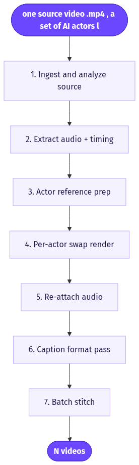
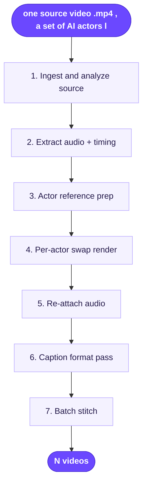

# Recreate One Video with Multiple Actors

> Take one winning ad video and auto-generate the same ad performed by a batch of different AI actors, keeping the script, voice, timing and framing intact.

**Category:** AI clone/actor  **Inputs:** one source video (.mp4), a set of AI actors (library actors or front-facing character images), optional keep-original-voice toggle  **Output:** N videos (one per selected actor), same aspect ratio as the source (typically 9:16 vertical UGC), same length/script/voice/captions

## Flow diagram



<details><summary>edit as Mermaid</summary>


</details>

## What it does
You have one video that already works. Instead of reshooting or rewriting, this workflow swaps only the on-screen performer and re-renders the clip once per actor, preserving the original scene, camera movement, pacing, script and voice track. It turns a single proven creative into a fan-out of face variants for cheap A/B testing. It converts because the hardest variable in UGC ads is *which face resonates* — this lets you test 10 faces against the same locked winner without touching anything else.

## Inputs
- One source video (.mp4, clearly visible single subject, minimal extreme motion).
- A list of target actors — picked from the AI-actor library or uploaded as clear, front-facing character images.
- Optional: keep original audio/voice (default) or assign a new voice per actor.

## Output
N finished videos, one per selected actor. Each matches the source's aspect ratio (usually 9:16), length, script, timing, on-screen captions and — by default — the exact original voice track. Delivered as a ready-to-post batch.

## How it works (step-by-step pipeline)
1. **Ingest & analyze source** — Vision LLM parses the source video: subject position, framing, camera motion, background, and performance beats. PURPOSE: build a spec the swap must stay faithful to.
2. **Extract audio + timing** — Split the original voice track and word-level timing (ASR). PURPOSE: this track is preserved and drives the new actor's lip-sync.
3. **Actor reference prep** — For each chosen actor, normalize a front-facing reference (library actor or uploaded image).
4. **Per-actor swap render** — Video-to-video actor/face replacement model re-renders the clip with the new performer while locking camera, background, timing and composition. TOOL: motion/performance-transfer + Arcads' lip-sync engine. PROMPT APPROACH: "keep everything, replace only the person, match mouth to the supplied audio."
5. **Re-attach audio** — Original voice (or a new per-actor voice) is muxed back, lip-synced to the swapped face.
6. **Caption/format pass** — Re-burn existing captions, keep aspect ratio, export.
7. **Batch stitch** — Loop steps 3-6 across all actors, return the set.

## Reconstructed prompts
*Reconstructions of the method — not Arcads' verbatim prompts.*

Source analysis (vision LLM):
```
Analyze this ad video. Return JSON: shot_count, per_shot {duration_s, camera_move,
framing (CU/MS/WS), subject_position, background, on_screen_text}. Transcribe the
spoken VO with word-level timestamps. Flag any frames with extreme angle or heavy
motion that could degrade an actor swap.
```

Per-actor swap directive (v2v + lipsync):
```
Recreate this video with a NEW performer from the reference image. Preserve exactly:
camera movement, scene, background, framing, pacing, and the original audio track.
Replace only the on-screen person. Re-time the new actor's mouth to the supplied VO.
Do not alter script, timing, captions, or aspect ratio. Output 9:16.
```

Creative-OS reverse-engineer (per actor, regenerate path):
```
Convert the transcript+scene spec into a Seedance-native shot list. Header:
"N shots, {len}s, 9:16, amateur iPhone UGC...". Keep the SAME spoken lines and beat
timing; only the actor changes. Spoken lines under 10 words as - says: "..." -.
One ambient sound per shot. No music. No logo. No text on screen.
```

## Rebuild in Creative OS
Our stack has no native actor-swap-on-existing-footage node — that is the core gotcha. Two paths:
- **Regenerate (honest fit):** Content Analyzer (Claude vision) + whisper on the source → reconstruct the winner as a Seedance-native shot-list with fixed VO lines/timing. Loop KIE `bytedance/seedance-2` (standard tier) N times, each with a different AI-actor reference image in `reference_image_urls`; keep the shot-list constant. Then our normal whisper → caption-zone → ffmpeg karaoke burn. Caveat: Seedance re-generates its own audio/voice, so exact VO isn't preserved — overdub the original VO track post, or clone one voice, if voice must stay fixed.
- **True swap (what we'd add):** Bolt on a video-to-video / motion-transfer model (e.g. Higgsfield `motion_control` recast/puppeteer) to replace the performer on the real footage, preserving audio natively — closer to Arcads, but a new node outside the KIE Seedance path.

## Why it's worth stealing
- Multiplies one proven winner into a face-test matrix with near-zero creative cost — highest-ROI variable (the actor) isolated cleanly.
- Everything but the face is frozen, so results are attributable: performance deltas are the actor, not confounded by new scripts or edits.
- Slots directly onto our existing analyzer + whisper + caption stack; only the swap/regenerate node is new.
