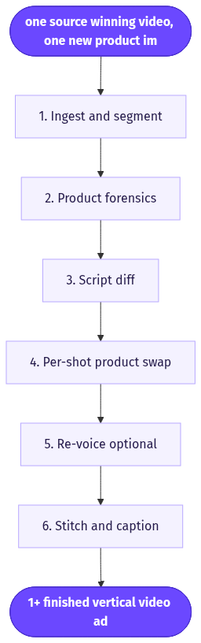
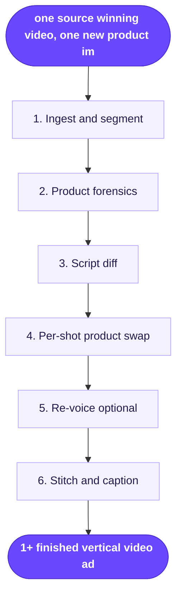

# Replace Product in Winning Ad
> Feed in a video ad that already converts plus a photo of your product, and get the same ad back with your product swapped in.

**Category:** UGC video  **Inputs:** one source ("winning") video, one new product image, optional product name/URL and keep-audio toggle  **Output:** 1+ finished vertical video ad(s), same length/pacing/aspect as the source (typically 9:16), original voiceover kept, captions re-burned

## Flow diagram



<details><summary>edit as Mermaid</summary>


</details>

## What it does
Takes a proven video ad — a competitor's or your own past winner — and re-shoots it around a new product with no creator, studio, or reshoot. The actor's performance, camera motion, edit rhythm, hook and beat structure all stay intact; only the product (and any line that names it) changes. It converts because you aren't gambling on cold creative — you inherit a format the market has already validated and pay only for the swap.

## Inputs
- One source video ad (mp4) — the winning ad to replicate
- One new product image (clean shot; more angles = higher fidelity)
- Optional: product name / landing URL (to rewrite product-specific spoken or on-screen lines)
- Optional: keep-original-audio vs. re-voice toggle

## Output
- One (or a batch of) finished ad(s) matching the source's length, pacing, and aspect ratio (usually 9:16)
- New product composited throughout; motion, actor, and edit preserved
- Original voiceover retained (or regenerated) and captions re-burned to match

## How it works (step-by-step pipeline)
1. **Ingest & segment** — Purpose: break the source into shots + a timeline and locate the old product. Tool: scene-cut + LLM vision (Claude) + whisper transcription. Prompt approach: "Per shot, return start/end, camera move, what's on screen, and when/where the product appears."
2. **Product forensics** — Purpose: describe the NEW product exactly. Tool: Claude vision. Prompt approach: forensic detail (shape, material, label text, colors) so generation keeps fidelity.
3. **Script diff** — Purpose: rewrite only product-specific spoken/on-screen lines; keep hook, structure, timing. Tool: LLM.
4. **Per-shot product swap** — Purpose: place the new product into each shot while preserving the original motion. Tool: motion-control video model (Kling 2.6 Motion Control style) with the source shot as motion reference and the product image as subject; or masked video inpainting on the product region. Prompt approach: "Transfer this clip's motion/framing exactly; replace the shown product with THIS one; match lighting, perspective, contact shadow, scale."
5. **Re-voice (optional)** — Purpose: swap the product name in audio. Tool: TTS/voice clone + lipsync.
6. **Stitch & caption** — Purpose: reassemble shots in original order and re-burn captions. Tool: ffmpeg.

## Reconstructed prompts
*(Reconstructions of the method — not Arcads' verbatim prompts.)*

Shot analysis (LLM vision over sampled frames):
```
You are analyzing a winning video ad shot by shot. For each shot output JSON:
{ index, t_start, t_end, camera_move, on_screen_text, spoken_line,
  product_visible (bool), product_region ("held in right hand" / "on table left"),
  lighting ("hard key top-left, warm"), framing ("MCU, product mid-frame") }
Keep the hook, pacing, and beat order intact.
```

Product swap (motion-control video step, per shot):
```
MOTION REFERENCE: <source_shot_04.mp4>
SUBJECT / PRODUCT REFERENCE: <new_product.jpg>
Recreate this shot exactly: same camera move, framing, hand and body motion, timing.
Replace the product being held/shown with the product in the reference image.
Match scene lighting direction, perspective, contact shadows, and on-screen scale.
Do not alter the actor, background, or edit. Keep original audio.
```

Script diff (LLM):
```
Transcript of a winning ad below. Rewrite ONLY lines that name or describe the OLD
product so they fit the NEW product (<name/benefit>). Preserve word count and timing
per line so lipsync/captions still land. Return line-by-line old -> new.
```

## Rebuild in Creative OS
- **Ingest & segment** → reuse our whisper (Groq) transcription and the Content Analyzer's Claude-vision plumbing as a new "shot reader"; add a scene-cut pass. Emit our Seedance-native shot format (header `N shots, 15s, 9:16, amateur iPhone UGC...` then `Shot n (0-3s | BEAT):` joined with `Cut to`).
- **Product forensics** → our existing Content Analyzer (Claude vision, forensic product description), reused directly.
- **Script diff** → the Strategist prompt run in a trimmed diff-only mode, or a small standalone Claude call.
- **Per-shot swap** → the real gap. Our KIE `bytedance/seedance-2` (standard) path with `reference_image_urls` = new product photo reproduces the FORMAT but regenerates footage, not the original actor/motion. For a true product-only swap, add KIE's **Kling 2.6 motion-control** endpoint (motion ref = source shot, subject = product) or a masked-inpaint model. Gotchas: Seedance ignores rendered text (keep all captions post) and mini tier garbles labels — use standard; product fidelity rides entirely on the reference image; motion-control can drift on identity, so keep clips short (per-shot).
- **Stitch & caption** → reuse whisper → Claude caption-zone → ffmpeg karaoke burn (Montserrat ExtraBold) plus ffmpeg concat, unchanged.
- **Legal note:** regenerating a competitor's *structure* is safer than pixel-copying their footage — prefer the shot-list regeneration path over exact motion-clone for competitor sources.

## Why it's worth stealing
- **De-risks creative spend:** you inherit a validated winner instead of testing cold concepts.
- **Near-zero marginal cost to re-skin one winner across a whole catalog** — swap the product image, get a new ad.
- **Builds a template flywheel:** every proven ad becomes a reusable format, turning one-off winners into an evergreen library.
