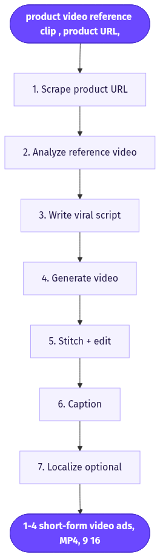
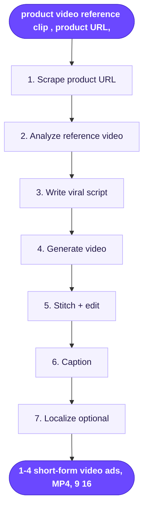

# Short Form Ad Generator

> Feed a product video plus a product URL, an LLM writes a viral short-form script, and Seedance renders it into a finished, ready-to-post ad.

**Category:** UGC video  **Inputs:** product video (reference clip), product URL, optional product name/angle  **Output:** 1-4 short-form video ads, MP4, 9:16 (also 1:1 / 16:9), captioned + voiced, localizable

## Flow diagram



<details><summary>edit as Mermaid</summary>


</details>

## What it does
It turns an existing product clip and a landing-page URL into a fresh, scroll-stopping ad without re-shooting. The URL is scraped for benefits, features and offers so the LLM has real selling points; the uploaded video seeds Seedance with the product's true look, motion and setting. Because the script is angle-driven (hook + benefit + CTA) and the visuals are grounded in the real product, output reads as authentic UGC rather than generic stock, which is what converts on TikTok/Reels/Shorts.

## Inputs
- A product video to upload (the reference/anchor clip — real product footage)
- A product URL (landing/PDP page — source of copy angles, features, price, offer)
- Optional: product name, target angle/persona, target language

## Output
- 1-4 finished short-form video ads (batchable), MP4
- Primarily 9:16 vertical; 1:1 and 16:9 variants available
- Native voiced audio (AI actor / VO), burned captions, optional 30+ language localization
- Each clip up to ~15s; longer ads assembled by stitching multiple Seedance clips

## How it works (step-by-step pipeline)
1. **Scrape product URL** — headless fetch/parser pulls page copy, features, benefits, price, offer, hero imagery. Feeds the script step real substance.
2. **Analyze reference video** — ffmpeg extracts 8-20 frames + audio; Whisper transcribes. An LLM reads structure, pacing, camera, tone and dialogue rhythm, producing a parameterized style template (scene count, beats, energy).
3. **Write viral script** — LLM combines scraped selling points + extracted style into a short UGC script: strong hook (0-3s), one core benefit, CTA. ~30-40 words for 15s, spoken in first person, plain language.
4. **Generate video** — Seedance 2.0 renders from the script with `referenceVideos`/`referenceImages` = the uploaded product clip, native audio on, 4-15s, chosen aspect ratio. Multi-clip strategy for longer ads.
5. **Stitch + edit** — clips concatenated (ffmpeg); optional B-roll, music, transitions.
6. **Caption** — Whisper word timestamps → burn karaoke-style captions.
7. **Localize (optional)** — translate script + re-voice per target language.

## Reconstructed prompts
*Reconstructions of the method, not Arcads' verbatim prompts.*

Script LLM:
```
You write viral short-form ad scripts.
PRODUCT (from URL): {{scraped_benefits, features, price, offer}}
REFERENCE STYLE (from video): pacing={{pace}}, tone={{tone}}, 3-beat arc.
Write a 15s first-person UGC script, ~35 words, spoken lines only:
- Beat 1 (0-3s): scroll-stopping hook (problem or bold claim)
- Beat 2 (3-11s): one core benefit, concrete + specific
- Beat 3 (11-15s): CTA.
Plain spoken language, <10 words per line. No hashtags, no emojis.
```

Seedance 2.0 (video):
```
model: seedance-2.0
referenceVideos: [product_clip.mp4]   // anchors real product look/motion
generateAudio: true
aspectRatio: 9:16
duration: 15
prompt: "Amateur iPhone UGC. Person holds {{product}}, talks to camera in a
{{setting}}. Beat 1 hook, cut to demo, cut to CTA. Natural light, handheld.
Says: '{{beat1}}' ... '{{beat2}}' ... '{{beat3}}'. Ambient room tone. No on-screen text."
```

## Rebuild in Creative OS
- **Scrape node** — NEW: add a fetch+parse step before the analyzer to pull PDP copy (we currently only host an image). Cheap n8n HTTP + Claude extraction.
- **Analyzer** — extend our Content Analyzer (Claude vision) to also ingest reference-video frames + a Whisper pass, emitting a style block.
- **Strategist** — our existing one-shot Claude Director already emits the Seedance-native shot-list ("N shots, 15s, 9:16, amateur iPhone UGC..." + numbered beats + `- says: "..."`). Feed it the scraped angles + extracted style.
- **Video** — KIE `bytedance/seedance-2` standard tier, 9:16, `generate_audio:true`. Gotcha: KIE exposes `reference_image_urls` cleanly; a true reference-*video* path may need mini-vs-standard testing (mini garbles labels — use standard). If video-ref unsupported, fall back to product frames as image refs.
- **Captions** — reuse Whisper (Groq) → Claude caption-zone → ffmpeg Montserrat karaoke burn as-is.
- **Stitch** — ffmpeg concat for >15s (Seedance 15s/clip cap). Remember Seedance ignores rendered text, so all captions stay post.

## Why it's worth stealing
- **URL + video grounding** kills the "generic AI ad" look: real copy angles + real product footage = authentic, high-fidelity UGC.
- **Repurposes existing assets** — one client clip becomes many fresh, angle-tested ads with near-zero shoot cost.
- **Maps almost 1:1 onto our stack** — only new part is a URL-scrape node; analyzer, Strategist, KIE Seedance, and caption chain already exist.
