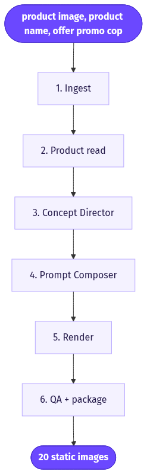
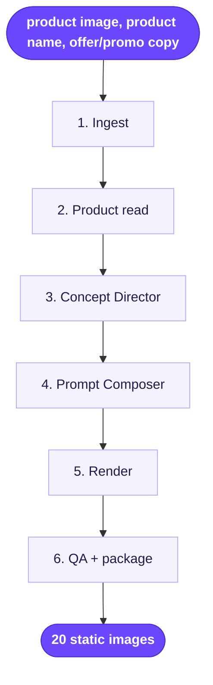

# Static Ad Offers (1:1 & 9:16)

> Turn one product photo plus your offer details into 20 text-driven static ad variations, each built on a proven "winning concept" layout and rendered in both 1:1 and 9:16.

**Category:** static-image ads  **Inputs:** product image, product name, offer/promo copy, headline, CTA, optional brand colors  **Output:** 20 static images (PNG/JPG), 1:1 and 9:16, text baked in, no voice/localization

## Flow diagram



<details><summary>edit as Mermaid</summary>


</details>

## What it does
It mass-produces offer-driven static ads by pouring one product image and one offer into 20 different, pre-vetted ad *structures* (comparison tables, "Apple Notes" lists, fake search results, iMessage/chat threads, editorial hero, sticky-note flatlays, review/testimonial cards, price-slash badges). Instead of one design gamble, you get a spread of angles and layouts to A/B test at once. It converts because the winning-concept templates already have proven scroll-stopping composition and safe-zone typography, so the model only has to swap in *your* product and offer, not invent a design.

## Inputs
- Product image (the hero; used as the visual reference)
- Product name
- Offer / promo details (e.g. "40% off", "Buy 1 Get 1", free shipping)
- Headline and short CTA
- Optional: brand colors, logo, target aspect ratios

## Output
20 finished static images. Text (headline, offer, CTA) is rendered directly into each image, so no captions/voiceover/localization step. Delivered in 1:1 (feed) and 9:16 (Stories/Reels), split across the batch or both per concept.

## How it works (step-by-step pipeline)
1. **Ingest** — Host the product image and capture the offer fields. *Tool:* form/webhook + object storage.
2. **Product read** — Forensic description of the product (exact shape, colors, label text, logo) so renders stay faithful. *Tool:* vision LLM. *Prompt approach:* "Describe this product precisely enough to reproduce it; note every visible word/logo."
3. **Concept Director** — Map the offer onto 20 distinct proven ad archetypes and write per-slot copy (chosen layout, headline, subhead, offer badge, CTA, palette, format). *Tool:* LLM. *Prompt approach:* pick diverse *winning concepts*, one brief per variation, as structured JSON.
4. **Prompt Composer** — Expand each brief into a full image prompt: label the reference role, state what to preserve vs. change, append safe-zone + "no platform chrome" guards. *Tool:* LLM/templating.
5. **Render** — Generate each concept with the product image as reference. *Tool:* GPT2 = gpt-image-2 (max ~5 refs; native 1:1, plus 9:16). Loop 20 briefs x formats.
6. **QA + package** — Vision-check text legibility and product fidelity; regenerate failures; return the grid.

## Reconstructed prompts
*These reconstruct the method; they are not Arcads' verbatim internal prompts.*

Concept Director (LLM):
```
You are a direct-response static-ad creative director.
PRODUCT: {name} — {forensic_description}
OFFER: {offer}  HEADLINE: {headline}  CTA: {cta}  BRAND COLORS: {colors}
Return a JSON array of 20 ad concepts. Each must use a DIFFERENT proven
static-ad structure from: comparison table, Apple-Notes list, fake Google
result, iMessage thread, editorial hero, sticky-note flatlay, 5-star review
card, price-slash badge, before/after, "as seen in" strip.
Per item: {structure, headline, subhead, offer_badge, cta, palette, format}
where format is "1:1" or "9:16". Keep copy punchy; no fabricated claims.
```

gpt-image-2 render (one concept):
```
Create a {format} direct-response ad. STRUCTURE: {structure}.
Reference image = the product; preserve its exact shape, color, label and
logo. Do NOT redraw the product. Render crisp legible text:
Headline "{headline}", subhead "{subhead}", badge "{offer_badge}",
button "{cta}". Palette {colors}. Clean, premium, high-contrast.
Keep all text within the central 84% safe zone. No app UI, no platform
badges, no engagement icons, no watermark.
```

## Rebuild in Creative OS
Reuse the **image host** (MaxFusion S3) and the **Content Analyzer** (Claude vision) verbatim for step 2. Repurpose the **Strategist** into a Static Concept Director that emits a 20-item JSON array instead of a Seedance shot-list — this is essentially the existing Static Ads Generator (nano-banana-pro + prompt-composer + QA gate) rather than the video branch. Swap the KIE seedance-2 call for an **image** endpoint: `reference_image_urls` = hosted product photo, generate 1:1 and 9:16. **Drop** the whisper -> caption-zone -> ffmpeg tail entirely (text is baked in). Add the QA gate as a Claude-vision legibility/fidelity check with auto-regenerate. *Gotchas:* gpt-image-2's native ratios are 1:1/3:2/2:3 — for true 9:16 use nano-banana-pro (full Meta ratio set) or outpaint/reframe; text legibility is the main failure mode, so keep the safe-zone suffix and QA loop; host every render to S3 immediately (KIE-style URLs rot in ~24h).

## Why it's worth stealing
- **Concept diversity in one run:** 20 structurally different ads means real creative A/B coverage from a single input, not 20 recolors of one idea.
- **Template library is the moat:** the "winning concepts" encode proven layout + safe-zone typography, so the model just swaps product/offer — high hit rate, low art direction.
- **No post-production:** text bakes into the image, killing the whisper/caption/ffmpeg tail and making it far cheaper and faster than the video pipeline.
