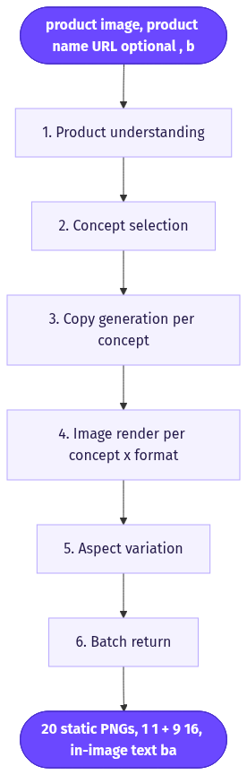
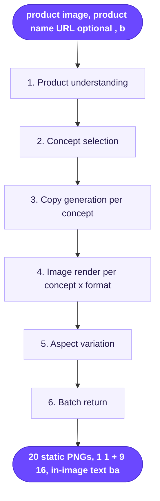

# Static Ad Templates (1:1 & 9:16)

> Upload one product image and get 20 launch-ready static Meta ads, each built on a proven "winning concept" layout and rendered by GPT Image 2 in both square and vertical formats.

**Category:** static-image ads  **Inputs:** product image, product name/URL (optional), brand color/copy context (optional)  **Output:** 20 static PNGs, 1:1 + 9:16, in-image text baked in (no voice, no post-captioning, no localization)

## Flow diagram



<details><summary>edit as Mermaid</summary>


</details>

## What it does
It maps one product photo across a library of high-performing ad *concepts* (fake iMessage/Notes/Google-search UIs, comparison tables, editorial heroes, sticky-note flat lays, founder letters) rather than generating generic product shots. Each concept is a scroll-stopping structure that already converts on Meta; the model just re-skins it with your product and freshly-written copy. Because the text is native to the image (GPT Image 2 renders legible typography), every output is final on render and ready to launch as a test batch.

## Inputs
- One product image (the visual reference GPT2 keeps faithful).
- Product name and/or product URL (optional; seeds copy + product understanding).
- Optional brand hints: primary color, offer, one-line benefit.

## Output
- 20 static images, delivered as a batch grid.
- Two aspect ratios: 1:1 (feed) and 9:16 (Reels/Stories) — typically ~10 concepts x 2 formats.
- Fully composed: headline, body copy, and CTA are rendered *inside* the image. No voiceover, no burned-in captions, no translation.

## How it works (step-by-step pipeline)
1. **Product understanding** — PURPOSE: know what's being sold. TOOL: LLM vision over the uploaded image (+ URL scrape if given). PROMPT: forensic product description — category, label text, colors, form factor, use case.
2. **Concept selection** — PURPOSE: pick which winning-concept templates to spread the 20 across. TOOL: LLM chooser over a curated template library. PROMPT: "Pick N best-fit concepts for this product/audience; maximize diversity of format; no concept twice."
3. **Copy generation (per concept)** — PURPOSE: write the exact on-image words. TOOL: LLM. PROMPT: given the template's slots (title bar, list items, CTA pill) return short, benefit-led, spell-checked strings with no unsupported claims.
4. **Image render (per concept x format)** — PURPOSE: composite product + template + copy into a finished ad. TOOL: **GPT Image 2 ("GPT2")** with the product photo as a reference image (up to 5 refs). PROMPT: declare the artifact + aspect, describe the template UI/scene as physically real, quote each copy string verbatim in its named zone, keep product label faithful, keep text inside a safe zone.
5. **Aspect variation** — PURPOSE: hit both placements. TOOL: same render, re-run at 9:16 with vertical whitespace re-flowed (concept + copy held constant).
6. **Batch return** — PURPOSE: reviewable test set. TOOL: gallery/grid of the 20 PNGs.

## Reconstructed prompts
*Reconstructions of the method — not Arcads' verbatim prompts.*

Concept + copy step (LLM):
```
You are a direct-response static-ad creative director.
PRODUCT: "<name>" — <vision description of uploaded image>
TEMPLATE (winning concept): "Apple Notes checklist"
Write the on-image copy for ONE ad on this template. Return JSON:
{ "title": "...", "checklist": ["...","...","..."], "cta": "..." }
Rules: max 6 words/line; concrete benefit-led; only claims the product supports;
correct spelling; no em dashes; no placeholders.
```

Render step (GPT Image 2, product photo = reference image 1):
```
Static ad, 1:1. Photoreal iPhone screenshot of the Apple Notes app.
Reference image 1 = the product: place it as the note's attached photo,
reproduce its label, colors, and shape faithfully.
Notes title bar: "Why I finally switched" in native iOS Notes type.
Body is a green-check checklist, each item on its own line:
  ✓ <checklist_1>   ✓ <checklist_2>   ✓ <checklist_3>
Bottom: rounded CTA pill "<cta>" filled with brand color #<hex>, white text.
Realistic status bar, soft paper-white background, crisp legible typography.
Nothing touches the edges; all text within an 88% safe zone.
Negative: watermark, garbled text, invented logos, warped elements.
```

9:16 variant: identical scene and copy, first clause becomes `Static ad, 9:16`, and vertical whitespace above/below the note is expanded so the checklist sits centered.

## Rebuild in Creative OS
This maps almost 1:1 onto our existing static-ads n8n pipeline (`Docs/Static Ads Generator/Static Ads v6 - Node Pack.md`) — it is a static-image flow, so the **Seedance shot-list format and KIE seedance-2 are not used here** (no video, no whisper/ffmpeg captions; text is native to the render).

- **Product understanding + concept selection** → our `Pick Templates1` + `Concept Director` nodes already choose N template/mechanism/angle concepts and mix in a brand's `winning_ads`. To match Arcads' "winning concepts," seed our CreativeOS template library (Airtable) with the same proven blueprints (Apple Notes, fake Google/Slack/iMessage, comparison table, sticky note, founder letter).
- **Copy** → `Concept Director` already emits `copy_blocks` (headline/subline/cta) per concept.
- **Render** → swap our default `nano-banana-pro` for **GPT Image 2 on KIE** for the typography/UI-mimicry templates (use the `gpt-image-2-style-library` skill for its prompt templates); GPT2 renders dense legible in-image text that nano-banana garbles. Keep nano-banana-pro for photoreal/lifestyle concepts. Product photo goes in `image_input` as the reference.
- **QA Gate + Auto-Fix** → already verifies each copy string rendered verbatim and legibly — essential for text-heavy templates.
- **What we'd add:** a dual-aspect loop. Our `Parse Platform` currently locks one aspect per run; wrap the render+QA so each concept is generated at both `1:1` and `9:16` (change `aspect_ratio`, re-flow whitespace) to deliver the promised 20-across-two-formats batch.

Gotchas: GPT Image 2 caps at **5 reference images** (vs nano-banana-pro's 8) — budget product/logo refs accordingly. Route Apple-Notes / fake-UI / comparison templates to GPT2; route product-in-scene lifestyle to nano-banana-pro.

## Why it's worth stealing
- **The template library is the moat.** Proven fake-UI/editorial/comparison layouts force the model into scroll-stopping structures instead of forgettable product shots — that's what makes them convert.
- **One image → 20 placement-ready creatives** across feed + Reels = an instant Meta test batch at near-zero cost (~$0.09-0.15 per rendered ad on KIE).
- **Native in-image text = final on render.** No post-captioning step; GPT Image 2 handles legible typography our video pipeline cannot, so the asset ships the moment it renders.
