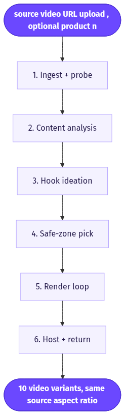
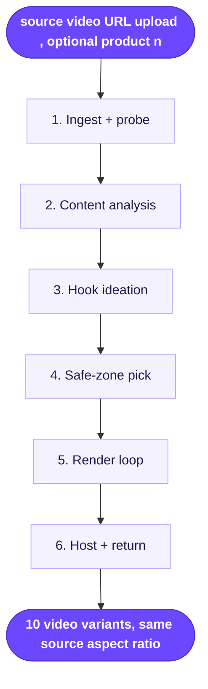

# Text Hook Overlay

> Takes an existing video, understands what's in it, writes 10 scroll-stopping hook lines, and burns each one onto the opening of the clip as a ready-to-test caption overlay.

**Category:** hook tool  **Inputs:** source video (URL/upload), optional product name/context  **Output:** 10 video variants, same source aspect ratio (typically 9:16), each with a distinct text hook burned onto the first ~3s (no re-voicing, no translation)

## Flow diagram



<details><summary>edit as Mermaid</summary>


</details>

## What it does
It multiplies one finished video into 10 A/B-testable variants by changing only the highest-leverage element: the on-screen text hook. The pipeline "watches" the video, infers the product, angle and tone, then generates 10 short curiosity/promise/pain hooks and renders each over the opening frames. It converts because the first 1.5-3 seconds and the silent-scroller text overlay decide most of the watch-through, so cheaply spinning up 10 hook angles on proven footage is the fastest path to a winner.

## Inputs
- One source video (upload or URL) — usually an existing UGC/actor clip or ad.
- Optional: product name, category, or one-line offer for sharper hooks.
- Optional style knobs: font, position, hold duration.

## Output
- 10 rendered video variants, identical footage, one unique text hook each.
- Same aspect ratio as the source (typically 9:16 vertical).
- Overlay only — audio, voice and language are untouched (not captioned in full, not localized).

## How it works (step-by-step pipeline)
1. **Ingest + probe** — accept the video, read duration/aspect/fps (ffprobe). Purpose: know the canvas for later text placement.
2. **Content analysis** — sample keyframes (ffmpeg every ~1s) + transcribe the spoken audio (whisper/Groq), feed both to a vision LLM. Prompt goal: a compact brief — product, benefit, format, tone, existing spoken hook.
3. **Hook ideation** — LLM (Claude) turns the brief into 10 distinct 2-6 word overlay hooks across angles (curiosity, pain, social proof, contrarian, outcome). Return strict JSON.
4. **Safe-zone pick** — vision LLM inspects the opening frames and returns a text box that avoids the face/subject/existing captions.
5. **Render loop** — for each of the 10 hooks, ffmpeg `drawtext` burns the line (bold font, stroke/box for legibility) at the chosen zone, held for the first ~3s. Output 10 files.
6. **Host + return** — push variants to storage, return URLs.

## Reconstructed prompts
*Reconstruction of the method, not Arcads' verbatim prompts.*

Step 2 — video → brief (vision LLM):
```
You are a DR ad analyst. Below are keyframes and the audio transcript of a short ad.
Return JSON: { "product": "", "core_benefit": "", "format": "", "tone": "",
"spoken_hook": "", "target_pain": "" }. Be concrete; infer product from visuals + transcript.
Transcript: """{whisper_text}"""
```

Step 3 — 10 hooks (Claude):
```
Product brief: {brief_json}
Write 10 TEXT-OVERLAY hooks for the first 3 seconds of this vertical video.
Rules: 2-6 words each, readable sound-off, no emojis, no period.
Cover distinct angles: curiosity, pain, contrarian, social proof, outcome, "I almost returned this".
Return JSON array of 10 strings only.
```

Step 5 — render (ffmpeg, per hook):
```
ffmpeg -i in.mp4 -vf "drawtext=fontfile=Montserrat-ExtraBold.ttf:text='{hook}':
fontsize=64:fontcolor=white:borderw=6:bordercolor=black:x=(w-tw)/2:y=h*0.12:
enable='lt(t,3.2)'" -c:a copy out_{i}.mp4
```

## Rebuild in Creative OS
- **Ingest/host:** existing MaxFusion S3 + webhook.
- **Content analysis:** reuse the Content Analyzer (Claude vision) but feed ffmpeg keyframes + whisper(Groq) transcript instead of a single product image — a small "video brief" wrapper.
- **Hook ideation:** one Claude prompt (OpenRouter), same pattern as the Strategist but far simpler; enforce JSON.
- **Safe-zone:** reuse the caption-zone vision step we already run before burning karaoke captions.
- **Render:** reuse the ffmpeg caption burner — swap the karaoke word-timing for a static top-center `drawtext` held ~3s, loop over 10 hooks.
- **No Seedance/KIE:** this decorates existing footage; nothing is generated. Same philosophy as our pipeline (Seedance ignores rendered text, so all text is post) — we're just reusing the burn stage standalone.
- **Gotchas:** legibility over busy footage (add stroke or semi-transparent box); don't cover baked-in captions; keep hooks ≤6 words or they wrap; 10 re-encodes are cheap single-pass jobs, parallelize the loop.

## Why it's worth stealing
- **Highest ROI edit:** hook is the #1 performance lever; this makes 10 tests from one proven asset in minutes.
- **Reuses what we already have:** ffprobe + whisper + Claude vision + ffmpeg drawtext — no new model, no Seedance spend.
- **Compounding:** feed winning footage back in to keep mining new hook angles, turning one hit into a testing engine.
