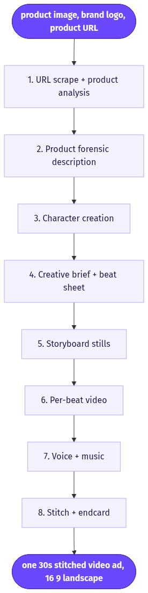
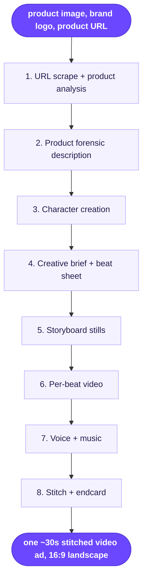

# TV Style Ads

> Turns a product image, brand logo, and product URL into a fully generated 30-second, broadcast-style commercial with a recurring character, a scripted narrative, and a stitched multi-scene edit.

**Category:** long-form  **Inputs:** product image, brand logo, product URL  **Output:** one ~30s stitched video ad, 16:9 landscape (9:16 / 1:1 variants optional), voiced + music bed, brand logo endcard

## Flow diagram



<details><summary>edit as Mermaid</summary>


</details>

## What it does
Instead of a single UGC selfie clip, this workflow builds a polished TV-commercial arc: hook, problem, product reveal, benefit demo, and a branded sign-off. It invents a consistent on-screen character/spokesperson, writes a creative brief and beat sheet from the scraped product page, renders a storyboard still per beat, animates each still, then stitches them into one continuous 30s spot. It converts because it mimics the pacing, character continuity, and closing brand moment audiences already trust from broadcast advertising.

## Inputs
- Product image (hero shot, used as the fidelity reference)
- Brand logo (for the endcard and any on-screen branding)
- Product URL (scraped for name, benefits, price, and brand tone)

## Output
- One stitched ~30s video (2-4 Seedance clips joined), 16:9 by default; 9:16/1:1 exportable
- Voiced (VO narration or lip-synced character dialogue) over a music bed
- A recurring character across scenes plus a logo endcard; captions optional

## How it works (step-by-step pipeline)
1. **URL scrape + product analysis** — LLM over the fetched page. PURPOSE: extract product name, category, top 3 benefits, price, audience, brand voice.
2. **Product forensic description** — vision LLM on the product image. PURPOSE: lock exact colors, label text, and shape so every scene stays on-model.
3. **Character creation** — image model (GPT Image 2 / Nano Banana Pro). PURPOSE: generate a reusable spokesperson/mascot character sheet (hero portrait + angles) for cross-scene consistency.
4. **Creative brief + beat sheet** — LLM. PURPOSE: objective, audience, one key message, and an 8-12 beat arc (hook → problem → reveal → demo → proof → CTA/logo).
5. **Storyboard stills** — image model. PURPOSE: one composited still per beat combining the product reference, character reference, and brand colors; used as start/end frames.
6. **Per-beat video** — Seedance 2.0 image-to-video. PURPOSE: animate each still (start→end frame), 4-8s each, with native motion/audio.
7. **Voice + music** — actor/lip-sync voice engine + music bed. PURPOSE: VO or synced dialogue plus a broadcast-style track.
8. **Stitch + endcard** — ffmpeg. PURPOSE: concatenate beats in order, overlay logo endcard, CTA text, and optional captions; export.

## Reconstructed prompts
*Reconstructions of the method, not Arcads' verbatim prompts.*

Creative brief / beat sheet (LLM):
```
You are a TV commercial creative director. Product: {name}. Benefits: {b1,b2,b3}.
Audience: {aud}. Brand tone: {tone}.
Write a 30s spot as 10 beats. For each beat give: beat name, duration (s),
on-screen action, the character's line (<12 words), and a shot description.
Arc: hook (0-3s) -> problem -> product reveal -> benefit demo -> proof ->
CTA + logo endcard. Keep the SAME character in every beat.
```

Storyboard still (image model):
```
Cinematic TV-commercial frame, {beat action}. Feature the exact product from
reference (match label, color, shape). Same character as reference sheet,
consistent face/wardrobe. Brand palette {colors}. Soft key light, shallow depth,
premium commercial look, 16:9. No text, no logo baked in.
```

Per-beat Seedance shot (Creative OS native):
```
2 shots, 6s, 16:9, polished TV commercial, cinematic key light.
Shot 1 (0-3s | REVEAL): hero holds product to camera - says: "This changed my mornings." | ambient: soft room tone
Cut to
Shot 2 (3-6s | DEMO): product in use, slow push-in | ambient: gentle whoosh
No text on screen. Product must match reference image exactly.
```

## Rebuild in Creative OS
- **Scrape/analyze:** add a URL-fetch node feeding our **Content Analyzer** (Claude vision) so it describes both page copy and product image.
- **Character:** add a **nano-banana-pro** character-sheet node; save the hero frame as a locked reference URL reused for every storyboard still.
- **Brief:** extend the **Strategist** prompt to emit a TV beat sheet (not a UGC shot list) — reuse our numbered `Shot n (a-bs | BEAT):` + `Cut to` grammar per beat.
- **Stills → video:** GPT-image/nano-banana per beat, then **KIE `bytedance/seedance-2` (standard)** i2v with `reference_image_urls` = the storyboard still, `generate_audio` on, 1080p.
- **Stitch:** existing ffmpeg on the VPS concatenates clips and burns the logo endcard/CTA (Seedance ignores rendered text, so logo + captions stay post).
- **Gotchas:** Seedance 2.0 caps ~15s/clip → stitch 2-4 clips for 30s; character drift across stills is the main risk (lock one reference face); relax our "No music" rule to a music bed; KIE URLs rot in 24h, so persist assets before stitching.

## Why it's worth stealing
- **Premium framing at scale:** a broadcast-style narrative and logo endcard read as higher-budget than UGC, unlocking DTC brands that reject selfie ads.
- **Reuses our whole stack:** analyzer → strategist → nano-banana → Seedance → ffmpeg already exist; we only add URL-scrape, a character node, and a stitch/endcard step.
- **Character continuity is the moat:** a locked, reusable spokesperson across scenes (and future ads) builds brand recall that single-clip generators can't match.
