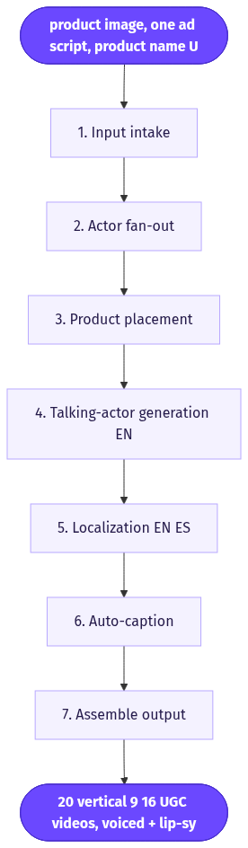
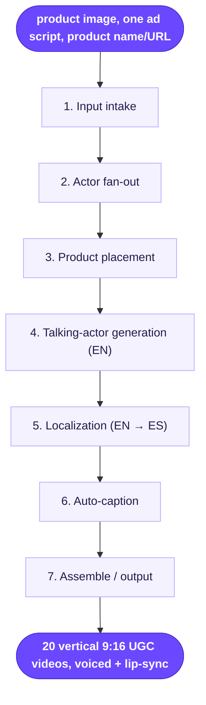

# UGC Product Showcase with Localization

> One script plus one product image fans out into 20 lip-synced UGC ads — 10 different AI creators, each in English and Spanish.

**Category:** UGC video (with translation/localization)  **Inputs:** product image, one ad script, product name/URL (optional)  **Output:** 20 vertical 9:16 UGC videos, voiced + lip-synced, auto-captioned, in English and Spanish (10 characters × 2 languages)

## Flow diagram



<details><summary>edit as Mermaid</summary>


</details>

## What it does
Takes a single winning script and one product photo and mass-produces a matrix of talking-head UGC ads: the same words, delivered by 10 distinct AI creators (varied age/gender/ethnicity/setting), each rendered once in English and once in Spanish. It converts because it turns one creative bet into a broad A/B test surface — many faces find the winning presenter cheaply, and the localized cut unlocks US-Hispanic and LATAM audiences from the same input with zero re-shoot.

## Inputs
- One product image (auto-detected, no manual cropping)
- One ad script (the exact spoken VO for all clips)
- Optional: product name / landing URL for on-screen context
- Implicit config: 10 selected AI actors, target languages = English + Spanish

## Output
20 finished videos: 10 characters × 2 languages. Vertical 9:16, social-native UGC. Each clip is voiced with a synced AI-actor performance (real lip-sync, blinking, gestures), the product held or shown in-frame, burned-in captions in the clip's language, ready to post.

## How it works (step-by-step pipeline)
1. **Input intake** — Ingest script + product image; auto-segment the product so it can be composited later. Tool: image detector + text store. Purpose: one source of truth for all 20 renders.
2. **Actor fan-out** — Select 10 AI actors from the library (or generated avatars). Purpose: demographic/setting diversity. No prompt; it's a selection loop that spawns 10 parallel branches.
3. **Product placement** — Composite the product image into each scene (held by actor / on surface). Tool: GPT-image compositor. Prompt approach: place product realistically in the actor's hands, correct scale/lighting, preserve label fidelity.
4. **Talking-actor generation (EN)** — For each of the 10 actors, render them speaking the script. Tool: Arcads AI-actor + lip-sync + voice engine (motion-capture-driven). Prompt approach: script text + emotion/gesture cues ("upbeat, gestures to product on the hook line"). Output: 10 English clips.
5. **Localization (EN → ES)** — Run each EN clip through Translate Video: LLM translates the script, TTS re-voices in a Spanish accent, and the actor's mouth is re-lip-synced to the new audio. Output: 10 Spanish clips (same faces).
6. **Auto-caption** — Burn word-timed captions per clip in its language. Tool: transcription + caption renderer.
7. **Assemble / output** — Stitch, format 9:16, export all 20.

## Reconstructed prompts
*Reconstructions of the method — not Arcads' verbatim internal prompts.*

Actor performance direction (step 4):
```
Actor: [ACTOR_ID]. Deliver this script to camera as authentic UGC, casual and
energetic, like recommending to a friend. Hold/show the product on the hook line.
Natural gestures, eye contact, light smile. Vertical selfie framing.
SCRIPT: "[verbatim ad script]"
```

Localization (step 5):
```
Translate the script to LATAM-neutral Spanish for a UGC ad. Match spoken duration
per line so lip-sync stays tight (keep syllable count close). Localize idioms and
the CTA naturally — do not translate literally. Preserve brand/product names.
SCRIPT: "[verbatim ad script]"  ->  return only the Spanish VO.
```

Product placement (step 3):
```
Place [PRODUCT] naturally in the person's hand at chest height. Match scene lighting
and perspective, realistic scale, keep the label/packaging sharp and unaltered.
```

## Rebuild in Creative OS
- **Actor fan-out** — We have no native lip-sync actor engine, so instead of 10 library actors we pre-generate 10 character reference images (Nano Banana Pro / GPT-image, our `ugc-hot-girl`-style prompts for variety), then loop KIE `bytedance/seedance-2` (standard tier) once per character, passing `reference_image_urls = [character_ref, product_photo]`, 9:16, `generate_audio: true`.
- **Script → shots** — Reuse the Strategist to wrap the fixed script in our Seedance-native shot-list ("N shots, 15s, 9:16, amateur iPhone UGC…", numbered `Shot n (0-3s | HOOK):`, spoken lines as `- says: "..." -` under 10 words, one ambient sound, ends "No music. No logo. No text on screen."). Product fidelity comes from the reference image.
- **Localization** — We don't re-dub; we regenerate. Have the Strategist emit a second shot-list with the `- says: -` lines rewritten in LATAM-neutral Spanish, run 10 more Seedance jobs. Whisper (Groq) does Spanish word timestamps → Claude picks caption zones → ffmpeg burns Spanish karaoke captions.
- **Captions** — Our existing whisper → Claude-zones → ffmpeg (Montserrat ExtraBold) path, run per language since Seedance ignores rendered text.
- **Gotchas:** Seedance regenerates rather than re-lip-syncs, so faces won't be identical across EN/ES unless the same character ref is reused (it can be — reuse the ref for both language runs). KIE mini garbles labels — stay on standard. Fan-out is 20 KIE jobs + 20 caption passes; queue and watch the 24h URL rot, host finals to S3 immediately.

## Why it's worth stealing
- **One input, 20 tested assets** — a single script/image becomes a 10-face × 2-language A/B matrix; you discover the winning presenter and market without extra creative work.
- **Localization for free** — same pipeline doubles reach into Spanish-speaking audiences with no re-shoot, just a translate-and-regenerate branch.
- **Demographic diversification is the real lever** — varying the face across 10 creators is the cheapest, highest-leverage way to lift UGC win rate, and this workflow makes it a one-click fan-out.
