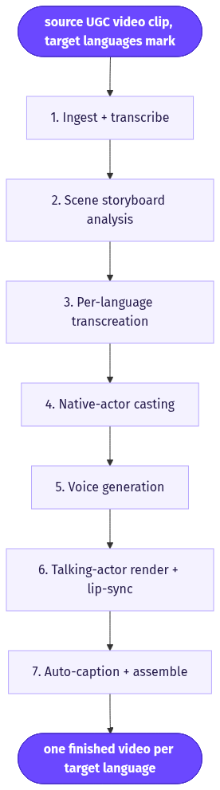
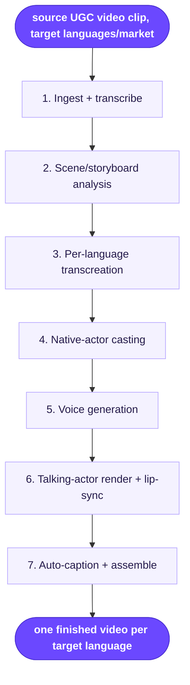

# UGC Super Translator

> Turn one winning UGC ad into a batch of market-localized versions, each re-performed by an AI actor who looks native to the target country.

**Category:** translation/localization  **Inputs:** source UGC video clip, target languages/markets (optional accent, optional product name/URL)  **Output:** one finished video per target language (same aspect as source, typically 9:16 vertical), voiced + lip-synced + captioned in the target language, performed by a native-looking actor

## Flow diagram



<details><summary>edit as Mermaid</summary>


</details>

## What it does
It takes an already-proven UGC clip and rebuilds it for other markets instead of just slapping on subtitles. The workflow analyzes the original's scenes, dialogue, timing, and emotion, then transcreates the script per language and re-performs it with an AI actor who reads as local. It converts because a winning creative is the hardest part to find, and this multiplies one validated ad across 10+ markets with no reshoot, no new voice talent, and casting that feels native rather than dubbed.

## Inputs
- One source UGC video clip (the winning ad to localize)
- One or more target languages / markets (multi-select)
- Optional: preferred accent per market
- Optional: product name/URL for on-brand terminology

## Output
One finished video per selected language. Each is the same aspect ratio as the source (UGC is usually 9:16), fully voiced in the target language, lip-synced, auto-captioned in that language, and fronted by an AI actor matched to the market's demographics. Ten languages = ten ready-to-post clips in one run.

## How it works (step-by-step pipeline)
1. **Ingest + transcribe** — ASR (Whisper-class) pulls the spoken script with word-level timestamps. Purpose: recover exact dialogue and beat timing.
2. **Scene/storyboard analysis** — LLM vision over sampled frames produces a structured shot list: setting, framing, action, product moments, per-beat duration, emotion/energy. Purpose: a re-castable blueprint of the original.
3. **Per-language transcreation** — an LLM translates *and* culturally adapts each spoken line per market, preserving hook, beat count, and per-beat word budget (not literal translation). Purpose: it must still land as an ad in the new language.
4. **Native-actor casting** — selects an AI actor from the library matching the target country's look/demographic. Purpose: native-looking trust.
5. **Voice generation** — text-to-speech (or speech-to-speech to carry the original delivery) renders the localized script with matched pacing/emotion.
6. **Talking-actor render + lip-sync** — the AI-actor engine performs the matching scenes, lip-synced to the new audio.
7. **Auto-caption + assemble** — burns target-language karaoke captions and stitches to the final per-language clip.

## Reconstructed prompts
*Reconstructions of the method, not Arcads' verbatim prompts.*

Storyboard extraction (vision LLM over source frames + transcript):
```
You are analyzing a winning UGC ad to make it re-castable in other markets.
Input: sampled frames + timestamped transcript.
Return JSON: { shots: [ { start_s, end_s, beat (hook/problem/product/proof/CTA),
setting, framing, actor_action, product_on_screen (bool), emotion, spoken_line } ],
total_duration_s, aspect_ratio }.
Report exact per-beat timing. Do not invent shots.
```

Per-language transcreation (LLM):
```
Transcreate this ad for {market} in {language}. Keep the SAME beat order and
per-beat timing budget from the storyboard. Make each spoken line sound like a
real local creator, not a translation. Keep hook punchy, <10 words per line,
preserve product name "{product}". Output only the new spoken_line per shot.
```

## Rebuild in Creative OS
- **Ingest/transcribe:** reuse our Groq Whisper node (already used for caption timestamps) to transcribe the source clip and get word timings.
- **Analysis:** feed sampled frames to the **Content Analyzer** (Claude vision), then have the **Strategist** emit our Seedance-native format — header `N shots, 15s, 9:16, amateur iPhone UGC...` then `Shot n (0-3s | BEAT): ... Cut to ...` with `- says: "..."` under 10 words. This becomes the source-of-truth shot list.
- **Transcreation:** add one OpenRouter/Claude node that rewrites only the `says:` lines per language, keeping shots, beats, and word budget intact.
- **Casting:** we lack Arcads' actor library, so pre-generate one **native-actor reference image per market** (GPT-image / nano-banana or the UGC-girl skill) and pass it as `reference_image_urls`.
- **Video:** KIE `bytedance/seedance-2` standard, 9:16. **Gotcha:** Seedance's non-English audio/lip-sync is unreliable — safer to render with `generate_audio` off (or ignore its audio) and dub via TTS + a lip-sync pass (e.g. Higgsfield dubbing), then re-burn captions.
- **Captions:** whisper is multilingual — set the target language and reuse the Claude caption-zone → ffmpeg karaoke path (swap font for scripts that need it).
- **Honest limit:** we regenerate matching scenes from the shot list rather than editing the literal source footage, so scenes *rhyme* with the original, they don't pixel-match. Product fidelity still comes from the reference image.

## Why it's worth stealing
- Squeezes maximum ROI from a single validated ad: one winner becomes N market-native creatives with no reshoot.
- Native-looking actor per market beats plain subtitles/dubs on trust and CTR.
- The "video → structured, re-castable shot list" front-end is reusable on its own: point it at any winning organic or competitor clip and get an editable Seedance-ready storyboard.
