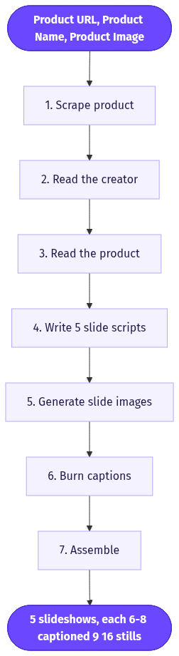
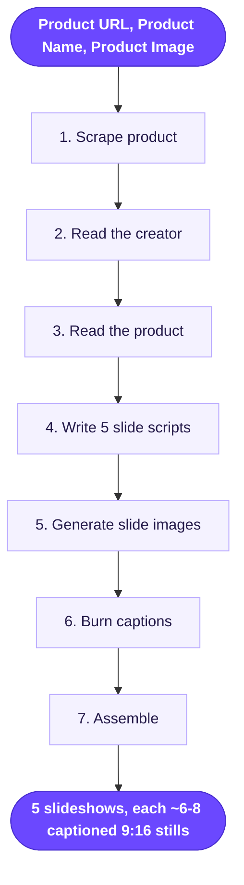

# UGC TikTok Slideshow

> Turns a product URL and a creator photo into 5 native TikTok "Photo Mode" slideshows, each a swipeable stack of captioned images written in the voice of that creator's demographic.

**Category:** static-image ads  **Inputs:** Product URL, Product Name, Product Image, Creator Image  **Output:** 5 slideshows, each ~6-8 captioned 9:16 stills (native TikTok Photo Mode look); captioned, not voiced, single-locale

## Flow diagram



<details><summary>edit as Mermaid</summary>


</details>

## What it does
It clones the highest-organic-reach format on TikTok right now: the swipeable photo carousel set to trending audio. Slideshows force a physical swipe, which drives dwell time and click-through above autoplay video, and they cost almost nothing to produce. The trick is that the on-slide caption copy is rewritten to match both the *creator's* apparent demographic (age, gender, vibe read from their photo) and the *product's* buyer, so each of the 5 variations reads like a real person's post, not an ad.

## Inputs
- **Product URL** - scraped for benefits, positioning, price, audience.
- **Product Name** - anchor for copy and search keywords.
- **Product Image** - reference so the product renders faithfully on slides.
- **Creator Image** - the "poster." Vision infers demographic and sets the copy voice; also used as a face/style reference so the creator appears in slides.

## Output
5 independent slideshows. Each is an ordered set of ~6-8 vertical (9:16) still images with text baked on in TikTok's native white-caption-sticker style, ready to upload to Photo Mode (or optionally rendered as a silent vertical MP4 for feed upload). No voiceover; single language unless localized downstream. Structure per slideshow: hook slide → 3-5 value/proof slides → CTA slide.

## How it works (step-by-step pipeline)
1. **Scrape product** (LLM + fetch). Pull the URL, extract benefits, hero claims, price, and inferred buyer. Prompt goal: a tight product/audience brief.
2. **Read the creator** (vision LLM). From the Creator Image, infer age band, gender, ethnicity cue, and "vibe" (gym-bro, cozy mom, Gen-Z chaos). Prompt goal: a persona + slang register the copy must sound like.
3. **Read the product** (vision LLM). Forensic description of the product (color, label, form) so image gen stays faithful.
4. **Write 5 slide scripts** (LLM). For each of 5 slideshows, produce 6-8 slides as `{image_prompt, caption}`. Enforce: scroll-stopping hook slide, one idea per slide, native lowercase/emoji register matched to the persona + buyer, keyword-rich, CTA final slide. Prompt goal: 5 distinct angles (problem/solution, before-after, listicle, "things I wish I knew", POV).
5. **Generate slide images** (GPT-image / Nano-Banana-Pro). Per slide, render the described scene using Creator Image + Product Image as references (creator holding/using product, POV shots, flat-lays). Prompt goal: authentic amateur-phone look, not studio.
6. **Burn captions** (image-model text or ffmpeg overlay). Lay the caption on each slide in TikTok's caption-sticker style. Keep text short so it renders clean.
7. **Assemble** (stitch). Order slides per slideshow, host, return the image set (and/or ffmpeg slideshow video with subtle Ken Burns + silent track sized for trending audio).

## Reconstructed prompts
*Reconstructions of the method, not Arcads' verbatim prompts.*

Creator-demographic read (vision):
```
Look at this person. Return JSON: {age_band, gender, ethnicity_cue,
vibe (2-3 words), how_they_talk (register + example slang),
platforms_they_post_on}. Base it only on visible cues.
```

Slide-script writer (LLM):
```
Product brief: {scrape}. Product look: {vision}. Poster persona: {creator_read}.
Write 5 TikTok Photo Mode slideshows selling this product AS this poster.
Each = 6-8 slides. Slide 1 = a scroll-stopping hook (curiosity/pain, no brand
name). Slides 2-6 = one benefit/proof per slide. Last = CTA.
Match the poster's register exactly (lowercase/emoji ok). Weave the product
name + a search keyword into 2 slides. Each of the 5 uses a different angle:
problem-solution, before/after, listicle, "things I wish I knew", POV.
Return JSON: [{slideshow, angle, slides:[{image_prompt, caption}]}].
Captions under 12 words.
```

Slide image (image model, per slide):
```
Amateur iPhone photo, 9:16, natural light. {slide.image_prompt}.
Use reference 1 (the creator) as the person and reference 2 (the product)
exactly as shown - keep label/color true. Candid, slightly imperfect,
no studio lighting, no added text.
[reference_images: creator.jpg, product.jpg]
```

## Rebuild in Creative OS
- **Intake:** reuse the webhook + MaxFusion S3 host, add a second upload slot for the Creator Image; add an HTTP node to fetch the Product URL.
- **Analysis:** our **Content Analyzer** (Claude vision) already does forensic product description - run it twice (product + creator) and fold the URL scrape into the brief.
- **Copy:** replace the Seedance shot-list **Strategist** with a *slide-script* variant emitting `{image_prompt, caption}` JSON per slide (this is the one net-new prompt). Keep the style buckets for the 5 angles.
- **Imagery:** swap the KIE/Seedance video call for our **Static Ads Generator** image path (Nano-Banana-Pro / GPT-image) with `reference_image_urls = [creator, product]`. Note the 5-reference and 9:16 caps on GPT-image.
- **Captions:** reuse the Claude caption-zone picker + ffmpeg drawtext (Montserrat ExtraBold) to burn TikTok-sticker text on stills instead of karaoke on video.
- **Assemble:** ffmpeg image2 to emit the ordered set, or a Ken-Burns MP4. Gotchas: image models garble long text - keep captions short and prefer post overlay; product fidelity comes from the reference image; ship images for Photo Mode (higher organic reach) rather than pre-baking audio.

## Why it's worth stealing
- **Cheapest winning format:** slideshows out-reach video on TikTok organic right now and cost pennies - no render, no lip-sync, no VO.
- **Persona-matched copy is the moat:** rewriting the same product 5 ways in 5 real-sounding voices is a pure LLM job we already do - instant batch of native-looking ads.
- **Reuses ~80% of our stack:** analyzer, image gen, and ffmpeg captions are already built; only the slide-script prompt is new.
