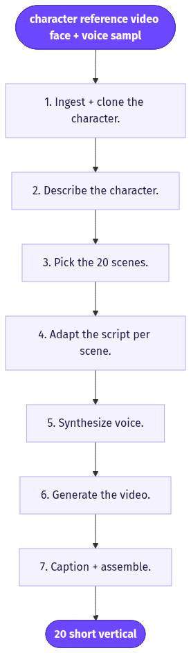
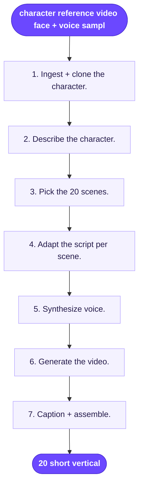

# Your Character in 20 Viral Scenes

> Upload one reference video of yourself (or a creator), and get an AI clone that performs your script across 20 proven viral UGC scenes with the same face and voice.

**Category:** AI clone/actor  **Inputs:** character reference video (face + voice sample), a script, optional product name/context, target aspect ratio  **Output:** 20 short vertical (9:16) UGC video clips, voiced in the cloned voice, auto-captioned

## Flow diagram



<details><summary>edit as Mermaid</summary>


</details>

## What it does
It turns a single clip of a person into a reusable digital twin, then drops that twin into 20 different "viral" UGC setups (car selfie, bathroom-mirror get-ready, street walk-and-talk, couch confessional, kitchen unboxing, desk close-up, etc.) all reading the same core script. It converts because it collapses a week of shooting into one upload: the creator never re-films, yet gets 20 native-looking, scene-varied hooks to A/B test — the volume that actually finds a winner. Same face and voice across all 20 keeps the account/brand consistent while the *setting and hook* vary.

## Inputs
- A character reference video (a few seconds of the person talking on camera — supplies both face identity and a voice sample).
- The ad/script text (one script; the system adapts the opening hook per scene).
- Optional: product name, product image, or short context/angle.
- Optional: aspect ratio (defaults to 9:16) and language.

## Output
20 separate short-form vertical clips (9:16), each the same cloned person in a different viral scene, speaking the script in their cloned voice with lip-sync, burned-in captions, ready to post. Each clip is an independent hook variant for testing.

## How it works (step-by-step pipeline)
1. **Ingest + clone the character.** PURPOSE: build a reusable identity. TOOL: actor-cloning + voice-clone engine (face embedding from frames, voice model from the audio track). PROMPT APPROACH: no text prompt — it extracts a face-lock reference set and a voice fingerprint from the uploaded clip.
2. **Describe the character.** PURPOSE: a consistency "character card." TOOL: vision LLM. PROMPT APPROACH: forensically describe face, hair, skin, wardrobe, age, and vocal quality so downstream steps can re-summon the same person.
3. **Pick the 20 scenes.** PURPOSE: variety that historically performs. TOOL: curated viral-scene library (setting + camera behavior + hook archetype). PROMPT APPROACH: select 20 distinct UGC formats and assign each a hook style.
4. **Adapt the script per scene.** PURPOSE: fit one message to 20 openings. TOOL: LLM. PROMPT APPROACH: keep the core pitch, rewrite the first line/hook to match each scene's context; output a spoken line + scene description per clip.
5. **Synthesize voice.** PURPOSE: same voice everywhere. TOOL: cloned-voice TTS → one audio track per scene.
6. **Generate the video.** PURPOSE: the clone performing the scene. TOOL: Seedance-2-class model with an Omni Reference system (character stills/video + audio) locking facial geometry, lip-synced phoneme→viseme. 9:16.
7. **Caption + assemble.** PURPOSE: readable delivery. TOOL: word-timestamp ASR → burned karaoke captions; batch-export all 20.

## Reconstructed prompts
*These are reconstructions of the method, not Arcads' verbatim prompts.*

Scene-director LLM (one call → 20 scene specs):
```
You are a UGC creative director. Input: one ad script + a character card.
Return 20 JSON scene objects. Each = {scene_id, setting, camera (handheld iPhone selfie/POV/mirror), wardrobe_note (consistent with card), hook_line (<10 words, rewritten to fit this setting), spoken_script (the core pitch, ~12s), ambient_sound}.
Rules: 20 DISTINCT everyday viral settings (car, mirror, street, couch, kitchen, gym, bed, desk...). Same person, same core message. Vary only setting + hook. No on-screen text.
```

Per-scene video prompt (Seedance-native, our format):
```
1 shot, 12s, 9:16, amateur iPhone UGC, handheld.
Shot 1 (0-12s | HOOK): @ref character (same face/hair/wardrobe as reference) sits in a parked car holding phone at arm's length, talking to camera, natural daylight through windshield. - says: "you need to hear this" - ambient: faint traffic hum. No music. No logo. No text on screen.
reference_image_urls = [character stills]; audio_reference = cloned voice line.
```

## Rebuild in Creative OS
- **Host + clone:** reuse the MaxFusion S3 host node for the reference video; extract stills as the character reference set. Add a **voice-clone node** (e.g. ElevenLabs) since KIE seedance-2's audio is *generative, not cloned* — this is the main gap to close for true voice match.
- **Content Analyzer (Claude vision):** point it at the person, not a product, to emit the character card (step 2).
- **Strategist:** swap the 15-format *product* library for a **20-viral-scene template library**; emit our Seedance-native shot format (header line + `Shot n (0-12s | BEAT):`, `- says:` under 10 words, one ambient sound, "No music. No logo. No text on screen."), one shot-list per scene.
- **Video:** KIE `bytedance/seedance-2` **standard** tier (mini garbles identity), 9:16, `reference_image_urls` = character stills; feed the cloned audio for lip-sync.
- **Captions:** existing Whisper (Groq) → Claude zone-pick → ffmpeg Montserrat karaoke burn, unchanged.
- **Gotchas:** identity drift across 20 gens — re-feed the same reference stills every scene and keep wardrobe fixed in the prompt; seedance-2's native voice won't match, so lip-sync the cloned audio in a post pass; watch KIE's 24h URL rot when batching 20.

## Why it's worth stealing
- **One shoot → 20 testable hooks:** maximum creative volume from a single upload, which is what actually finds winners.
- **Identity stays locked, context varies:** on-brand consistency (same face/voice) with the scene diversity the algorithm rewards.
- **Clean fit to our stack:** it's our existing product pipeline pointed at a *person* reference instead of a product photo — mostly reuse, one voice-clone node to add.
